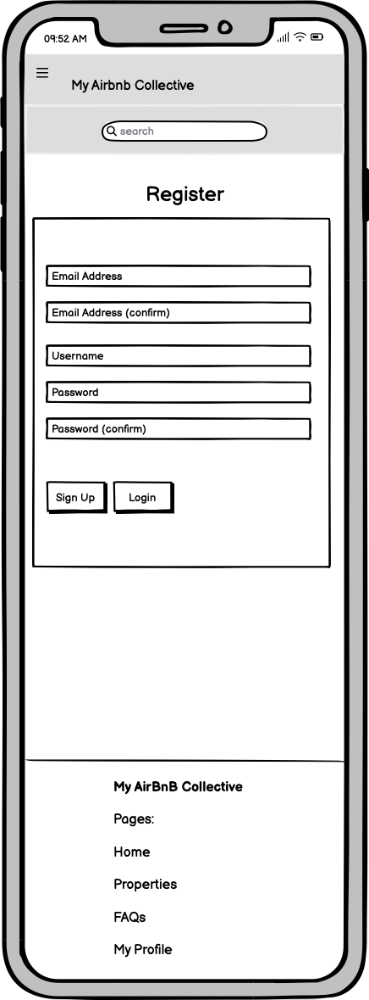

# Code Institute - Level 5 Diploma in Web Application Development - Milestone Project 4

# My AirBnB Collective

## About The Website

MyAirBnB Collective is an online booking platform for airbnb properties to make life as easy as possible for its users to stay away from home. The interactive website allows users to search through properties of their liking, searching by location and number of bedrooms too to make their journey as easy as possible. 

Users can book a property, add a taxi from the airport to the property, create a profile and look back at their previous bookings as well.

This is something I wanted to create as I sometimes have to travel for work and I liked the idea of having an easy platform, similar to ones that exist but adding extras such as knowing if they're pet friendly etc, and also to organise the taxi for me too so it's one less thing that I have to worry about. 

I liked the idea of this platform for users to potentially add their own properties and be reviewed by admin in the future too.

View the live website [here](https://my-airbnb-collective-57b00b515cab.herokuapp.com/).

# Contents
* [User Experience (UX)](#user-experience)
  * [Project Goals](#project-goals)
  * [User Stories](#user-stories)
* [Design](#design)
  * [Colour Scheme](#colour-scheme)
  * [Colour Accessibility](#colour-accessibility)
  * [Typography](#typography)
  * [Imagery](#imagery)
  * [Wireframes](#wireframes)
  * [Database Schema](#database-schema)
* [Features](#features)
  

  * [Scope Plane](#scope-plane)
    * [Feature Planning](#feature-planning)
  * [Structure Plane](#structure-plane)
    * [User Stories](#user-stories)
    * [Database Schema](#database-schema)
  * [Skeleton Plane](#skeleton-plane)
    * [Wireframes](#wireframes)
  * [Surface Plane](#surface-plane)
    * [Colour Scheme](#colour-scheme)
    * [Typography](#typography)
    * [Imagery](#imagery)
    * [Base Mockup](#base-mockup)
* [Features](#features)
  * [General Features of The Site](#general-features-of-of-the-site)
  * [Future Implementations](#future-implementations)
  * [Accessibility](#accessibility)
* [Technologies Used](#technologies-used)
  * [Languages Used](#languages-used)
  * [Database Used](#database-used)
  * [Frameworks Used](#frameworks-used)
  * [Libraries & Packages Used](#libraries--packages-used)
  * [Programs Used](#programs-used)
  * [Stripe](#stripe)
* [Deployment & Local Development](#deployment--local-development)
  * [Deployment](#deployment)
  * [Local Development](#local-development)
    * [How to Fork](#how-to-fork)
    * [How to Clone](#how-to-clone)
* [Testing](#testing)
* [Credits](#credits)
  * [Code Used](#code-used)
  * [Content](#content)
  * [Media](#media)
  * [Acknowledgments](#acknowledgments)

## User Experience

### Project Goals

The goal of the myairbnb-collective is to allow users to search through properties depending on location and number of bedrooms, as well as other factors such as pet friendly, wifi facilities etc to suit their needs. 

From here, once the user has chosen the property they like, they can then choose which dates they would like to stay at the property and proceed to checkout to book the property. From here, the user will also be given the option to create an account where they will be able to view their personal details and order history.

If the customer has any issues with their bookings, they also need the ability to contact the admin of the site with any queries, through phone number, email or contact form.

### User Stories

**Viewing & Navigation**

|As a ...            | I want to...                                            | So I can...                                                                                               |
|--------------------|---------------------------------------------------------|-----------------------------------------------------------------------------------------------------------|
|Shopper/ First Time | See all menu options on all devices clearly             | Navigate easily around the site to find what I want                                                       |
|Shopper/ First Time | See the purpose of the site immediately                 | To see if it is a product that I want or not, and understand it quickly before I leave the site           |
|Shopper/ First Time | View a list of properties                               | Choose a property that I would like to visit                                                              |
|Shopper/ First Time | View the properties locations                           | Decide if it is the right location for me to visit                                                        |
|Shopper/ First Time | View facilities such as wifi, pet friendly, parking etc | Decide quickly if it has the facilities that I need quickly, so I can find something suitable to my needs |
|Shopper/ First Time | View the properties details individual                  | Find out more about the specific property and its amenities that I wish to potentially book               |
|Shopper/ First Time | View a date range                                       | See what dates that I would like to book                                                                  |
|Shopper/ First Time | See how much my booking is once I have chosen dates     | See quickly if it is too expensive for me and possibly adjust the dates                                   |

**Registration And User Accounts**

|As a ...                    | I want to...                                                               | So I can...                                                                             |
|----------------------------|----------------------------------------------------------------------------|-----------------------------------------------------------------------------------------|
|registered/ registering user | Be able to register an account easily                                      | Have an account to view my profile                                                      |
|registered/ registering user | Be able to login in to my registered account                               | See my account details                                                                  |
|registered/ registering user | Recover my password incase I forget                                        | Continue to use my account I have created                                               |
|registered/ registering user | Receive an email confirmation when registering                             | Confirm that I have entered my correct details and the account will be registered to me |
|registered/ registering user | Have a user profile                                                        | See my personal information and view order history                                      |
|registered/ registering user | Be able to save my personal information to my profile when using checkout  | Save time having to enter my details again on future bookings                           |
|registered/ registering user | Be able to edit my personal information in my profile view                 | Update any change to my personal details or address                                     |
|registered/ registering user | Be able to logout from my account                                          | Keep my information safe if my device is left unattended                                |

#### Sorting And Searchings

As a shopper:

FINISH FINISH FINISH!!!!!

**Purchasing And Checkout**

|As a ...            | I want to...                                                               | So I can...                                                                                                                                                                     |
|----------------------------|----------------------------------------------------------------------------|---------------------------------------------------------------------------------------------------------------------------------------------------------------------------------|
|Shopper/ First Time | Easily select the specific dates of the property                           | Choose when I want to visit the property                                                                                                                                        |
|Shopper/ First Time | View items in my cart to be purchased                                      | View the total cost and list of the items I have added to my cart altogether                                                                                                    |
|Shopper/ First Time | View the total cost of my booking before checking out                      | Be aware beforehand of how much my purchase is before committing a payment                                                                                                      |
|Shopper/ First Time | Easily enter my payment information                                        | Complete my purchase with ease and not run into problems whilst trying to pay                                                                                                   |
|Shopper/ First Time | Know my personal information is secure                                     | Not worry about my payment and personal details being shared and potentially hacked                                                                                             |
|Shopper/ First Time | Save my personal details after filling them in                             | Make purchases quicker in the future by calling on the information already created in my account.                                                                               |
|Shopper/ First Time | View an order confirmation                                                 | See that my payment has been submitted successfully and my booking has been accepted                                                                                            |
|Shopper/ First Time | Receive an email to confirm my complete order                              | See further confirmation of my booking and have the details for my personal records.                                                                                            |
|Shopper/ First Time | Contact the store if i have any concerns regarding my account or purchases | Be assured that help is available and to confirm the sale as legitimate to me.                                                                                                  |
|Shopper/ First Time | See if there items in my cart visually                                     | Carry on shopping if i wish to do so knowing the previously chosen item is available for me to confirm later. Confirm that I have items that I have chosen in my shopping cart. |
|Shopper/ First Time | Be able to checkout without registering an account                         | Save time on completing my order if i do not wish to create an account                                                                                                          |
|Shopper/ First Time | Be able to create an account from the checkout page or login               | login or create an account if i do wish to save my information for personal use or to save time with my personal information next time i purchase from the site.                |

**Admin And Store Management**

As store owner/ admin:

|As a ...                      | I want to...                 | So I can...                                                                                 |
|------------------------------|------------------------------|---------------------------------------------------------------------------------------------|
| store owner/ admin.          | Add a property               | Expand the items for sale on my store                                                       |
| store owner/ admin.          | Edit property information    | Change information such as pet friendly etc if the property details change                  |
| store owner/ admin.          | Update pricing of a property | Add offers, increase or decrease price of property for the client                           |
| store owner/ admin.          | Delete property              | Delete a property if a property no longer wishes to be listed                               |
| store owner/ admin.          | Update order details         | Change details if a customer enters them wrong or needs to make a amendments to their order |

------------

## Design

### Colour Scheme

For the colour design of my website, I decided to use fairly neutral colours for header, footer and containers, as I wanted my site to be simplistic but also for parts to still stand out slightly. To achieve this, I used the bootstrap class bg-light for the header, footer and containers. I also used their buttons classes as they suited the website well and provided what i was looking for in terms of standing out. I wanted the design to be visually appealing but more importantly I wanted it to be easier for the user to read text one and not struggle with contrasts.

The main colours that I used we're

#### Bootstrap Classes

* Header - bg-light `#f8f9fa`
* Footer - bg-light `#f8f9fa`
* Containers (auth containers, contact form, order details, property item) - bg-light `#f8f9fa`
* Icons - text-primary `#0275d8`
* Hyperlinks - text-primary -`#0275d8`

#### Standard CSS

* Main Text - black `#000000`
* Nav Links - blue `#0000ff`
* Nav Links: Hover - Dark Blue `#00008B`
* Shopping Cart - blue `#0000ff`
* Shopping Cart: items in shopping cart - green `#008000`
* Overlay - white `#ffffff`
* H2 text over home page carousel - rgb(255, 255, 255, 0.6)
* Text overlay box for home page carousel (to make a better contrast of the text against the image) - rgba(0, 0, 0, 0.5)

### Colour Accessibility
---

The main goal of the site colour scheme and layout was accessibility for the user. I decided to use bold black text or blue hyperlinks, which stood out well against either the white background, or the bg-light bootstrap class (light grey) header, footer and container sections. I used the contrast checker from [coolors.co](https://coolors.co/contrast-checker/000000-f8f9fa)

#### **Black text `#000000` against white `#ffffff` background result:**

#### **Black text `#000000` against bootstrap bg-light `#f8f9fa` class result:**

#### **Buttons**
---

I also decided to keep button text as the default white in the bootstrap class as again it supplied a great contrast. Some of the results show poor results for this option but as it is default for bootstrap and is seen on many sites in this contrast as default, I decided to leave it. Here are the contrasts of the button classes used:

#### **White text `#ffffff` against 'primary' blue `#0275d8` bootstrap button:**

#### **White text `#ffffff` against 'danger' red `#d9534f` bootstrap button:**

#### **White text `#ffffff` against 'success' red `#5cb85c` bootstrap button:**

### Typography

For font family, I decided to use [open-sans](https://fonts.google.com/specimen/Open+Sans) from google fonts.
I liked this font because it was clear, simplistic, easy to read and kept the professional look to the website. The fall back font if the first one fails is sans-serif.
This is the default fall back font and is the same family as my chosen font so will only be a slight change in aesthetics if the first one does fail to open on the users browser.

### Imagery
---

#### **Logo**

The logo was created using Bing's AI image creator which can be found [here](https://www.bing.com/images/create?toWww=1&redig=589E1BF383EC4E6DB8AA3D2F3CB9C8C9).

I tried a few different designs, but I liked the simplicity of this one. I decided not to incorporate it into the website itself as I preferred it not taking up space anywhere. One option could have been to add it to the carousel images at the start, but its a completely different shape, and I think it would take away from showing the customer what the website is about by showing a logo instead of showing actual images of different properties which are the product.

#### **Carousel Images**

All images on the home page carousel section we're from [pexels.com](https://www.pexels.com/).

Image 1 from Binyamin Mellish

 

[link](https://www.pexels.com/photo/house-lights-turned-on-106399/)

Image 2 from Expect Best

 

[link](https://www.pexels.com/photo/modern-building-against-sky-323780/)

Image 3 from Terry Magallanes

 

[link](https://www.pexels.com/photo/four-brown-wooden-chairs-2635038/)

Image 4 from Pixabay

 

[link](https://www.pexels.com/photo/beige-bungalow-house-259588/)

Image 5 from Simon Sikorski

 

[link](https://www.pexels.com/photo/brown-brick-building-surrounded-by-plants-1131573/)

#### **All images**

All other images we're provided by [pexels.com](https://www.pexels.com/) and [pixabay.com](https://pixabay.com/) which supplied all images for property
exteriors, kitchens and bathrooms. These we're images that I collected all together and decided which images may suit a property the best in terms
of aesthetics. 

All icons for the website we're from [Font Awesome](https://fontawesome.com/)

### Wireframes
---

All wireframes we're created using [balsamiq](https://balsamiq.com/). I wanted to keep the designs similar on both mobile devices and full screen devices, but
moving things like buttons and text to fill the screen instead where before they may only be a 6 wide column (col-lg-6) on full screen devices. I wanted to do
this for accessibility for the user so nothing was becoming unclear for trying to squeeze all information into a small space on a smaller device.

#### **Full Screen Wireframes**
---

Home Page

 

Properties Page

 

Property Details Page

 

FAQs Page

 

Login Page

 

Register Page

 

Contact Us Page

 

Profile Page

 

Cart Page

 

Checkout Page

 

Edit Property Page

 

#### **Mobile/ Tablet Wireframes**
---

Home Page

 

Properties Page

 

Property Details Page

 

FAQs Page

 

Login Page

 

Register Page

 

Contact Us Page

 

Profile Page

 

Cart Page

 

Checkout Page

 

Edit Property Page

 

### Database Schema

## Features

hover effect for properties images provided from:

https://www.geeksforgeeks.org/how-to-zoom-an-image-on-mouse-hover-using-css/

couldn't get crispy forms to work, followed this: https://stackoverflow.com/questions/75495403/django-returns-templatedoesnotexist-when-using-crispy-forms

help with date picker:

https://stackoverflow.com/questions/59450570/how-to-create-start-date-and-end-date-picker-in-one-textbox-using-jquery-and-the

strip time datetime function:

https://www.geeksforgeeks.org/python-datetime-strptime-function/

redirect timeout found at:

https://stackoverflow.com/questions/16890899/how-can-i-make-a-delay-of-5-sec-while-redirecting-one-page-to-another-in-django