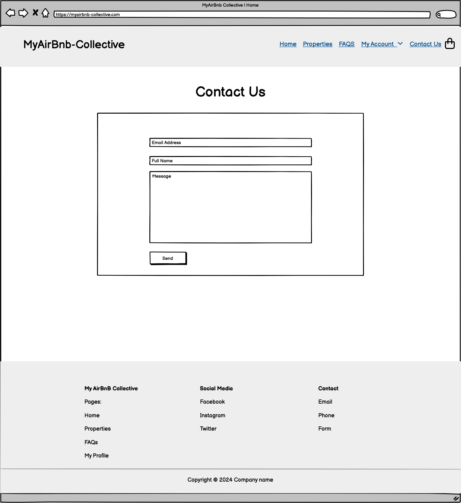
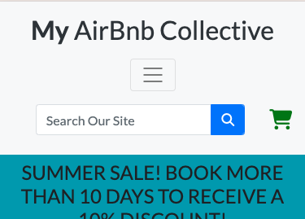
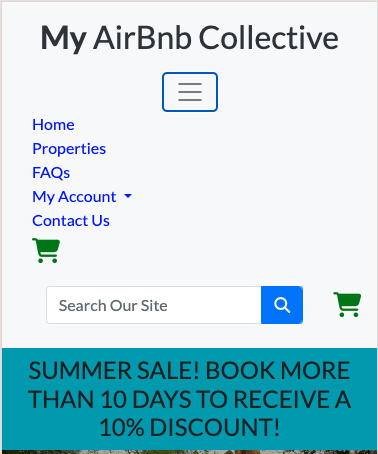

# Code Institute - Level 5 Diploma in Web Application Development - Milestone Project 4


# My AirBnB Collective


## About The Website

MyAirBnB Collective is an online booking platform for airbnb properties to make life as easy as possible for its users to stay away from home. The interactive website allows users to search through properties of their liking, searching by location and number of bedrooms too to make their journey as easy as possible. 

Users can book a property, add a taxi from the airport to the property, create a profile and look back at their previous bookings as well.

This is something I wanted to create as I sometimes have to travel for work and I liked the idea of having an easy platform, similar to ones that exist but adding extras such as knowing if they're pet friendly etc, and also to organise the taxi for me too so it's one less thing that I have to worry about. 

I liked the idea of this platform for users to potentially add their own properties and be reviewed by admin in the future too.


View the live website [here](https://my-airbnb-collective-57b00b515cab.herokuapp.com/).

# Contents
* [User Experience (UX)](#user-experience)
  * [Project Goals](#project-goals)
  * [User Stories](#user-stories)
* [Design](#design)
  * [Colour Scheme](#colour-scheme)
  * [Colour Accessibility](#colour-accessibility)
  * [Typography](#typography)
  * [Imagery](#imagery)
  * [Wireframes](#wireframes)
  * [Database Schema](#database-schema)
* [Features](#features)
  * [General Features of the site](#general-features-of-the-site)
    * [Header Section](#header-section)
    * [Footer Section](#footer-section)
    * [Pages](#pages)
  * [Future Implementations](#future-implementations)
* [Technologies Used](#technologies-used)
* [Deployment & Local Development](#deployment--local-development)
  * [Deployment](#deployment)
  * [Local Development](#local-development)
* [Testing](#testing)
* [Credits](#credits)
  * [Code Used](#code-used)
  * [Content](#content)
  * [Acknowledgements](#acknowledgements)


## User Experience

### Project Goals

The goal of the myairbnb-collective is to allow users to search through properties depending on location and number of bedrooms, as well as other factors such as pet friendly, wifi facilities etc to suit their needs. 

From here, once the user has chosen the property they like, they can then choose which dates they would like to stay at the property and proceed to checkout to book the property. From here, the user will also be given the option to create an account where they will be able to view their personal details and order history.

If the customer has any issues with their bookings, they also need the ability to contact the admin of the site with any queries, through phone number, email or contact form.

### User Stories


**Viewing & Navigation**

|As a ...            | I want to...                                            | So I can...                                                                                               |
|--------------------|---------------------------------------------------------|-----------------------------------------------------------------------------------------------------------|
|Shopper/ First Time | See all menu options on all devices clearly             | Navigate easily around the site to find what I want                                                       |
|Shopper/ First Time | See the purpose of the site immediately                 | To see if it is a product that I want or not, and understand it quickly before I leave the site           |
|Shopper/ First Time | View a list of properties                               | Choose a property that I would like to visit                                                              |
|Shopper/ First Time | View the properties locations                           | Decide if it is the right location for me to visit                                                        |
|Shopper/ First Time | View facilities such as wifi, pet friendly, parking etc | Decide quickly if it has the facilities that I need quickly, so I can find something suitable to my needs |
|Shopper/ First Time | View the properties details individual                  | Find out more about the specific property and its amenities that I wish to potentially book               |
|Shopper/ First Time | View a date range                                       | See what dates that I would like to book                                                                  |
|Shopper/ First Time | See how much my booking is once I have chosen dates     | See quickly if it is too expensive for me and possibly adjust the dates                                   |
|                    |                                                         |                                                                                                           |

**Registration And User Accounts**

|As a ...                    | I want to...                                                               | So I can...                                                                             |
|----------------------------|----------------------------------------------------------------------------|-----------------------------------------------------------------------------------------|
|registered/ registering user | Be able to register an account easily                                      | Have an account to view my profile                                                      |
|registered/ registering user | Be able to login in to my registered account                               | See my account details                                                                  |
|registered/ registering user | Recover my password incase I forget                                        | Continue to use my account I have created                                               |
|registered/ registering user | Receive an email confirmation when registering                             | Confirm that I have entered my correct details and the account will be registered to me |
|registered/ registering user | Have a user profile                                                        | See my personal information and view order history                                      |
|registered/ registering user | Be able to save my personal information to my profile when using checkout  | Save time having to enter my details again on future bookings                           |
|registered/ registering user | Be able to edit my personal information in my profile view                 | Update any change to my personal details or address                                     |
|registered/ registering user | Be able to logout from my account                                          | Keep my information safe if my device is left unattended                                |
|                    |                                                         |                                                                                                           |

**Sorting And Searching**

| As a ... | I want to...                                   | So I can...                                                                                                                                                                            |
|----------|------------------------------------------------|----------------------------------------------------------------------------------------------------------------------------------------------------------------------------------------|
| Shopper  | Sort the list of available properties          | Find quickly what I am looking for in all properties.                                                                                                                                  |
| Shopper  | Find a specific category of properties         | Be able to search quickly for my needs, and sort by price, location and category to know if a property is in the right location for me or in my price range.                           |
| Shopper  | Search for a property by name or description   | Quickly find a property I already know exists or find what suits my needs quickly, such as a city break or countryside, or if its in the location I want to stay at.                   |
| Shopper  | Sort items by ascending and descending options | See more options for my needs. If i need to find a property with the most bedrooms, I can sort it to the top of the list rather than search to the bottom of the page for the results. |
|                    |                                                         |                                                                                                           |

**Purchasing And Checkout**

|As a ...            | I want to...                                                               | So I can...                                                                                                                                                                     |
|----------------------------|----------------------------------------------------------------------------|---------------------------------------------------------------------------------------------------------------------------------------------------------------------------------|
|Shopper/ First Time | Easily select the specific dates of the property                           | Choose when I want to visit the property                                                                                                                                        |
|Shopper/ First Time | View items in my cart to be purchased                                      | View the total cost and list of the items I have added to my cart altogether                                                                                                    |
|Shopper/ First Time | View the total cost of my booking before checking out                      | Be aware beforehand of how much my purchase is before committing a payment                                                                                                      |
|Shopper/ First Time | Easily enter my payment information                                        | Complete my purchase with ease and not run into problems whilst trying to pay                                                                                                   |
|Shopper/ First Time | Know my personal information is secure                                     | Not worry about my payment and personal details being shared and potentially hacked                                                                                             |
|Shopper/ First Time | Save my personal details after filling them in                             | Make purchases quicker in the future by calling on the information already created in my account.                                                                               |
|Shopper/ First Time | View an order confirmation                                                 | See that my payment has been submitted successfully and my booking has been accepted                                                                                            |
|Shopper/ First Time | Receive an email to confirm my complete order                              | See further confirmation of my booking and have the details for my personal records.                                                                                            |
|Shopper/ First Time | Contact the store if i have any concerns regarding my account or purchases | Be assured that help is available and to confirm the sale as legitimate to me.                                                                                                  |
|Shopper/ First Time | See if there items in my cart visually                                     | Carry on shopping if i wish to do so knowing the previously chosen item is available for me to confirm later. Confirm that I have items that I have chosen in my shopping cart. |
|Shopper/ First Time | Be able to checkout without registering an account                         | Save time on completing my order if i do not wish to create an account                                                                                                          |
|Shopper/ First Time | Be able to create an account from the checkout page or login               | login or create an account if i do wish to save my information for personal use or to save time with my personal information next time i purchase from the site.                |
|                    |                                                         |                                                                                                           |

**Admin And Store Management**

As store owner/ admin:

|As a ...                      | I want to...                 | So I can...                                                                                 |
|------------------------------|------------------------------|---------------------------------------------------------------------------------------------|
| store owner/ admin.          | Add a property               | Expand the items for sale on my store                                                       |
| store owner/ admin.          | Edit property information    | Change information such as pet friendly etc if the property details change                  |
| store owner/ admin.          | Update pricing of a property | Add offers, increase or decrease price of property for the client                           |
| store owner/ admin.          | Delete property              | Delete a property if a property no longer wishes to be listed                               |
| store owner/ admin.          | Update order details         | Change details if a customer enters them wrong or needs to make a amendments to their order |
|                    |                                                         |                                                                                                           |


## Design

### Colour Scheme

For the colour design of my website, I decided to use fairly neutral colours for header, footer and containers, as I wanted my site to be simplistic but also for parts to still stand out slightly. To achieve this, I used the bootstrap class bg-light for the header, footer and containers. I also used their buttons classes as they suited the website well and provided what i was looking for in terms of standing out. I wanted the design to be visually appealing but more importantly I wanted it to be easier for the user to read text one and not struggle with contrasts.

The main colours that I used we're

#### **Bootstrap Classes**

* Header - bg-light `#f8f9fa`
* Footer - bg-light `#f8f9fa`
* Containers (auth containers, contact form, order details, property item) - bg-light `#f8f9fa`
* Icons - text-primary `#0275d8`
* Hyperlinks - text-primary -`#0275d8`

#### **Standard CSS**

* Main Text - black `#000000`
* Nav Links - blue `#0000ff`
* Nav Links: Hover - Dark Blue `#00008B`
* Shopping Cart - blue `#0000ff`
* Shopping Cart: items in shopping cart - green `#008000`
* Overlay - white `#ffffff`
* H2 text over home page carousel - rgb(255, 255, 255, 0.6)
* Text overlay box for home page carousel (to make a better contrast of the text against the image) - rgba(0, 0, 0, 0.5)

### Colour Accessibility
---

The main goal of the site colour scheme and layout was accessibility for the user. I decided to use bold black text or blue hyperlinks, which stood out well against either the white background, or the bg-light bootstrap class (light grey) header, footer and container sections. I used the contrast checker from [coolors.co](https://coolors.co/contrast-checker/000000-f8f9fa)

#### **Black text `#000000` against white `#ffffff` background result:**


#### **Black text `#000000` against bootstrap bg-light `#f8f9fa` class result:**


#### **Buttons**
---

I also decided to keep button text as the default white in the bootstrap class as again it supplied a great contrast. Some of the results show poor results for this option but as it is default for bootstrap and is seen on many sites in this contrast as default, I decided to leave it. Here are the contrasts of the button classes used:

#### **White text `#ffffff` against 'primary' blue `#0275d8` bootstrap button:**


#### **White text `#ffffff` against 'danger' red `#d9534f` bootstrap button:**


#### **White text `#ffffff` against 'success' red `#5cb85c` bootstrap button:**


### Typography

For font family, I decided to use [open-sans](https://fonts.google.com/specimen/Open+Sans) from google fonts.
I liked this font because it was clear, simplistic, easy to read and kept the professional look to the website. The fall back font if the first one fails is sans-serif.
This is the default fall back font and is the same family as my chosen font so will only be a slight change in aesthetics if the first one does fail to open on the users browser.

### Imagery
---

#### **Logo**

The logo was created using Bing's AI image creator which can be found [here](https://www.bing.com/images/create?toWww=1&redig=589E1BF383EC4E6DB8AA3D2F3CB9C8C9).

I tried a few different designs, but I liked the simplicity of this one. I decided not to incorporate it into the website itself as I preferred it not taking up space anywhere. One option could have been to add it to the carousel images at the start, but its a completely different shape, and I think it would take away from showing the customer what the website is about by showing a logo instead of showing actual images of different properties which are the product.


#### **Carousel Images**

All images on the home page carousel section we're from [pexels.com](https://www.pexels.com/).

<details>
<summary>Image 1 from Binyamin Mellish</summary>
<br>

</details>

[link](https://www.pexels.com/photo/house-lights-turned-on-106399/)

<details>
<summary>Image 2 from Expect Best</summary>
<br>

</details>

[link](https://www.pexels.com/photo/modern-building-against-sky-323780/)

<details>
<summary>Image 3 from Terry Magallanes</summary>
<br>

</details>

[link](https://www.pexels.com/photo/four-brown-wooden-chairs-2635038/)

<details>
<summary>Image 4 from Pixabay</summary>
<br>

</details>

[link](https://www.pexels.com/photo/beige-bungalow-house-259588/)

<details>
<summary>Image 5 from Simon Sikorski</summary>
<br>

</details>

[link](https://www.pexels.com/photo/brown-brick-building-surrounded-by-plants-1131573/)


#### **All images**

All other images we're provided by [pexels.com](https://www.pexels.com/) and [pixabay.com](https://pixabay.com/) which supplied all images for property
exteriors, kitchens and bathrooms. These we're images that I collected all together and decided which images may suit a property the best in terms
of aesthetics. 

All icons for the website we're from [Font Awesome](https://fontawesome.com/)


### Wireframes
---

All wireframes we're created using [balsamiq](https://balsamiq.com/). I wanted to keep the designs similar on both mobile devices and full screen devices, but
moving things like buttons and text to fill the screen instead where before they may only be a 6 wide column (col-lg-6) on full screen devices. I wanted to do
this for accessibility for the user so nothing was becoming unclear for trying to squeeze all information into a small space on a smaller device.

#### **Full Screen Wireframes**
---

<details>
<summary>Home Page</summary>
<br>

</details>

<details>
<summary>Properties Page</summary>
<br>

</details>

<details>
<summary>Property Details Page</summary>
<br>

</details>

<details>
<summary>FAQs Page</summary>
<br>

</details>

<details>
<summary>Login Page</summary>
<br>

</details>

<details>
<summary>Register Page</summary>
<br>

</details>

<details>
<summary>Contact Us Page</summary>
<br>

</details>

<details>
<summary>Profile Page</summary>
<br>

</details>

<details>
<summary>Cart Page</summary>
<br>

</details>

<details>
<summary>Checkout Page</summary>
<br>

</details>

<details>
<summary>Edit Property Page</summary>
<br>

</details>


#### **Mobile/ Tablet Wireframes**
---

<details>
<summary>Home Page</summary>
<br>

</details>

<details>
<summary>Properties Page</summary>
<br>

</details>

<details>
<summary>Property Details Page</summary>
<br>

</details>

<details>
<summary>FAQs Page</summary>
<br>

</details>

<details>
<summary>Login Page</summary>
<br>

</details>

<details>
<summary>Register Page</summary>
<br>

</details>

<details>
<summary>Contact Us Page</summary>
<br>

</details>

<details>
<summary>Profile Page</summary>
<br>

</details>

<details>
<summary>Cart Page</summary>
<br>

</details>

<details>
<summary>Checkout Page</summary>
<br>

</details>

<details>
<summary>Edit Property Page</summary>
<br>

</details>

### Database Schema

I decided to use a relational database for this project, using postgres sql, this seemed to be the best option for my needs 
for this project. I used [Draw SQL](https://drawsql.app/) to create the diagram for the schema.


**Registration Form**

The registration form section deals with the user being able to register an account to be able to save their personal details and to view past orders they have made.

* user_name - Username that the user can use to login to the site along with their chosen password.
* email - The user's email that they will use to register the account and receive correspondence from the company.
* password - The chosen password by the user that allows them to log in to their account alongside the username.

**User Profile**

User profile allows users to update their personal details/ billing address and also view past orders if they have completed registering an account. This database information is received from checkout when the user the user chooses 
save info at the bottom of the form. This collects data the user has filled in at checkout which includes:

* Email
* Phone Number
* Street Address 1
* Street Address 2
* County
* Postcode
* Country

The user's account also includes past orders if they have been completed and successful in checkout. This receives directly from the order database from the user's ID.
This section includes:

* Order Number - Created with UUID
* Date - date and time the user completed the purchase (received from OrderLineItem.model- date)
* Property - Property name that is booked (received from OrderLineItem.model- name)
* Dates Booked - Date range that is booked by the user (received from OrderLineItem.model- date_range)
* Order Total - Total Amount for order that the user has paid (received from OrderLineItem.model- lineitem_total)

**Category**

Category supplies categories for more options when the user is searching for criteria for a property. These include based on location such as city, countryside, romantic, beach etc.
These are then passed to property to give more options for the search and sorting criteria.

**Property**

Property is the main layout for all products. This includes the following:

* category - taken from model.category
* location - provides location of the property for search and sorting criteria
* name - Provides the name of the property
* description - Provides short description of property for properties page (to give a shorter description than full description used on property details to make accessibility easier for the user)
* full_description - Provides a full description of the property which is included on the property details pages.
* price_per_night - Provides integer pricing for total of each property to their nightly cost. (this was originally a decimal field but caused problems with stripe causing decimal multiplication. Because of this I changed it to integer and added float formats instead.)
* distance_to_airport - integer to show miles away from the nearest airport, and included to calculate the taxi pricing addon ( taxi price = £(distance to airport x 3))
* bedrooms - integer to show number of bedrooms at the property. Also used to calculate amount of guests allowed at a property (guest_total = bedrooms x 2)
* has_wifi - boolean to show if the property has wifi
* has_parking - boolean to show if the property has parking
* non_smoking - boolean to show if the property allows smoking
* pet_friendly - boolean to show if the property allows pets
* total_days - integer that collects how many days the user has booked a property for using the date_range value. is calculated by end_date minus start_date.

**Order**

Order collects all information when the order is passed. This collects address details which is created from the personal details form the user fills in.

* order_number - created by django's UUID
* Address - all address details are supplied from the personal details form the user fills in on checkout page. These are passed to user_profile if save_info is selected on checkout page.
* date - Date and time the order is complete. Also sent to user_profile for past orders information.
* guest_count - supplied from the property details page which is chosen by the user. This is simply so admin is aware of the amount of persons staying at the property, and has no affect on pricing etc.
* order_total - supplies order total which includes property total and taxi price added if the user has selected the taxi_price option.
* grand_total - supplies order total of all options chosen if the user has chosen more than one property to proceed to checkout with. This will total all properties and all taxi fares.
* original_cart - Pass on information that has been filled out in cart.
* stripe_pid - Pass on information to stripe from checkout.

**order_lineitem**

Order line item collects information for individual item. Its information is supplied from the order database and gives further information to admin for the order such as the date range the guest is staying for and how many days that equates to.

## Features

### General Features of the site

All pages will have the following:

* Favicon - For the favicon I used [Bing AI creator](https://www.bing.com/images/create) to create the design for the logo. I then used [favicon converter from favicon.io](https://favicon.io/favicon-converter/) to convert it to the appropriate size. 


#### **Header Section**
---

**NavBar**

The navbar will appear on all devices and all pages. This will include:

**Full Screen Navigation**
---


Full screen navigation includes The name of the company on the left side of the screen. This provides a hyperlinks that redirects back to the home page. This is for accessibility for the user to be able to return to the home page quickly. 

It includes the following links:

* Home - Link to home page. This is already supplied by the company name link on the left hand side of the screen, but is a also a clearer visual that it will return the user to the home page.
* Properties - Link to properties page. Allows user to view all properties available that they can book.
* FAQs - Link to FAQs to see questions and answers to enquiries that a customer may have. This is to potentially lower contact forms being submitted for questions already answered in this section. This makes less work for the admin and staff in answering simple enquiries for the company.
* My Account:
  * Register - Allows user to create an account so they can save personal details and view order history.
  * Login - Allows user to log in to their account if they have created one.
  * Logout (if user logged in) - If user is logged in, gives them the option to log out of their account.
  * Profile (if user logged in) - Links to user_profile, where user can update their personal details and view order history.
  * Manage Properties (if ADMIN is logged in) - Allows admin to go to properties page with the options to edit and delete properties in the properties list.
* Contact Us - Links to contact us form page for the user to contact the company
* Shopping Cart - Shopping cart logo that gives the user a link to their shopping cart. This is for accessibility and allowing the user to make a purchase quickly if they've chosen an item.

**Search Bar**

The navbar also includes a search bar which allows the user to search for a property by name, location or category and will direct the user to the properties page with the chosen criteria from the any page they may be currently on.

**Mobile Device Navigation**
---

**Mobile Navbar - Closed View**

The mobile navbar has a hamburger dropdown bar which provides all links. This helps the layout be cleaner for the user on mobile devices, allowing more screen room to be available for the main information such as properties, cart, checkout etc.

This still includes the search bar so users can still quickly find what they're looking for even when the menu is closed.



**Mobile Navbar - Open View**

When the hamburger icon is clicked, it opens the full menu for the user. These include all the options that are available in the full screen navigation explained above.




#### **Footer Section**
---

All device sizes include the footer section. Footer section includes the following:

* Page Map - This includes links to important pages such as home, properties, FAQs and My Profile. This is to make it more accessible for the user to quickly click on one of the links if they're already near the bottom of the page rather than having to scroll back to the top.
* Social Media Links - Links for facebook, instagram and twitter.
* Contact Us - Different options to contact the company including email, phone and contact form (link to contact us page)
* copyright section - Copyright of MyAirBnB Collective website including javascript to automatically update to current year.

**Footer On Full Screen Devices**


**Footer On Mobile Devices**


### Pages

**Home Page**

For my home page, I wanted it to be simplistic, and let the user know exactly what the site is for as quickly as possible. It includes a carousel of 5 images so its more interactive for the user and more exciting to look at than still images. The text remains over the top of all images saying 'Your Home Away From Home' as a slogan explaining that it is somewhere for the user to stay which is like being at home. 

Underneath the images theres a quick explanation of the site. I wanted to make sure the explanation was available underneath the images without the user having to scroll down, so I resized all carousel images accordingly using [bulkcropimage.com](https://bulkimagecrop.com/).


**Properties Page**

For properties page, I wanted the user to be able to view as many properties one page as possible without making them look squashed or losing information that is important for them to make the decision to find out more about the property (location, price etc). For full screen view I decided to have 4 cards ([bootstrap class](https://getbootstrap.com/docs/5.3/components/card/#about)) as this looked well spaced and allows the user to see all properties clearly. On mobile view I decided each item would be full width of the screen and user can scroll down. I found it looked squashed otherwise and the user is also able to search for criteria from the search bar and sort dropdown which means the user doesn't have to search through every property to find what they may want.


**Properties Details Page**

For property details, I wanted the user to be able to find out more information once they click on a property that they are interested in from the properties page. The page features 3 images. These images are labelled 'property_exterior', 'property_kitchen' and 'property_bathroom'. When the images are clicked on it opens a lightbox modal so the user can see the pictures more clearly. They can simply close the modal by clicking on the exit icon in the top right corner to return back to the page. The page shows the name and location of the property, including all other details such as price per night and number of bedrooms.

Next to the images the user can choose dates from the daterangepicker to select dates that they would like to stay at the property. once they have chosen these dates they can also choose guest count for how many guests will be staying. Underneath that information, once the 'go to checkout button' is clicked, they will be redirected to cart with the property and its chosen information available to complete the order.

Underneath the above information, the page also shows if the property has wifi, parking, is non smoking, is pet friendly in a ticked or crossed list making it visually clear to the user of what facilities are available at the chosen property. It also shows a larger description of the property.


**Cart Page**

Once the user has chosen go to checkout from property details or click on the shopping cart icon in the navigation section they will directed to the cart page. The cart page includes all products they added. It also has the option to add taxi to the booking, which when clicks it appends the taxi option and taxi price to the total. I wanted the this page to show all details of the property again without description so they could be aware before they checkout again of facilities etc. The full description seemed unneccessary at this point of the transaction as they've already added the property to their basket. They can also edit or delete their bookings from the cart. The edit button redirects the user to the property details page again with their date_range and number of guests filled in with their prior choice so they can amend. Once they are happy with all details they can proceed to checkout.


**Checkout Page**

The checkout page includes a form for the users details to be filled out. Some fields such as full name, email addres, phone number, street address 1, postcode and country have required attributes so must be chosen. If not the user is prompted again to fill them. After personal details there is a payment field for stripe payments to be passed to. Users are also given the option to save their information by creating an account of logging in to save their personal information for next time they use the store. Once they have completed all required fields, they can either adjust their cart which redirects to cart page, or they can proceed to payment. 

On the right hand side of the screen (on full screen. It remains underneath in mobile view) Details from cart are displayed again to confirm to the user what property they have chosen, what dates, total of days they are staying for, facilities at the property, if they have added a taxi or not, and grand total of the property.


**Checkout Success Page**

Once the checkout has been successful, the user is taken to the checkout success page. Here their order is confirmed, providing the user with a UUID order number for their order reference, all details about the booking itself that has been provided in the cart view.

It also contains one more section which shows the users personal details that they used to make the booking.

Both of these sections are in containers which also use the bootstrap CSS class bg-light. Checkout success also includes is_authenticated from django to stop people that aren't the current user from viewing the user's details.

**FAQs Page**

I decided to include an Frequently Asked Questions page to help users if they have any queries about the site. I have also added the option for admin to add more FAQs if they find they have a large number of enquiries about a certain question. This can help admin spend less time answering questions if the answers are available for the user from the website.

On all devices, all questions and answers are in a row down the page.


**My Account**

**Login Page**

Login page uses the base of allauth from django, but decided to add the background colour too which matches the header and footer (bootstrap class bg-light) to keep the theme of the website on all pages.


**Register Page**

Register page also uses the base of allauth from django. The background colour matches the header and footer (bootstrap class bg-light) to keep the theme of the website on all pages.


**Profile Page**

The profile page includes default personal information which the user can fill in and save, so it is available next time they use checkout to save time. It also includes order history so the user can see all past orders they have made.


**Manage Properties Page (ADMIN ONLY)**

Manage properties page is the same layout as the properties page so the admin can find their way across the page easily. The layout is identical apart from two added buttons for admin.

The two buttons are:

* Edit - Takes admin to an edit page which allows them to edit all details of the property including images for property exterior, property bathroom and property kitchen.
* Delete - Allows admin to delete a property from the properties list. If the admin clicks delete it directs to a modal which asks admin to confirm the deletion of the property incase of error in clicking the button.


**Edit Property Page (ADMIN ONLY)**

Edit property allows admin to edit all details of the property, from name, location, price per night to changing current images. The layout is full screen making it easier for the admin to see all details. Admin must confirm changes by clicking update property button or can cancel the changes by clicking cancel which will revert to current settings. Admin can also update category with dropdown menu for ease of use when they may have an event for romantic properties and need to move more properties into that category for sales purposes.


**Contact Us Page**

Contact page includes a simple form that requires all fields to be filled. These are email, name and message. It includes a button at the button that says 'send message' and sends the contact form details to the admin via email. To keep the theme of all other pages, the contact form container background is bootstrap colour class bg-light.


**Defensive Programming**

I have used defensive programming throughout the site to ensure security for all users. These include django's @login_required to show that a user must be logged in to preview such pages as profile and others that show personal details. 

I have also used if statements to check if the user is a superuser. This only provides access to admin or staff member with permissions from admin section. These pages include manage properties, edit properties, edit FAQs, delete properties etc. Users that don't have permission will not be able to access these views and pages.

### Future Implementations

For future implimentations I would like to add a reviews section on each property where users with a profile can leave reviews which would be triggered to be sent to them to review once the end date of their stay has been completed (I wouldn't want the user to be able to add this option before they have stayed at the property). This would be on a seperate page which would then store to the the users profile if they wish to update their review incase they made an error, and also for it to be a sorting criteria for the properties page, so users can search for properties based on their rating too. Ideally I would like the reviews to also appear on each property details page at the bottom so users can find out more information about the property and other user's experiences.

I think a blog page would also be beneficial for SEO purposes for the website, which gives admin a template to add these too similar to adding a property, with the ability to add tags that would be able to link to showing the criteria in the search section of the properties page.

is_authenticated has been added to checkout success, as it doesn't require the user to be logged in to their account but I don't want users that aren't the current user to be able to view the details available as this would be a security breach of the user's information.

ADD MORE!!!!!!!

### Technologies Used
---
**Languages Used**

HTML, CSS, Javscript, Python

**Database Used**

Sqlite3 for development
ElephantSQL for deployment

**Frameworks Used**
[Django](https://www.djangoproject.com/) - Version 3.2.5 - Django is a rapid web development framework that can be used to develop fully fleshed web applications in a short period of time.
[Bootstrap](https://getbootstrap.com/) - Version 4.4.1 - front-end development framework for the creation of websites and web apps. Designed to enable responsive development of mobile-first websites.

**Libraries & Packages Used**

[jQuery](https://jquery.com/) - Version 3.4.1 - Javascript framework.
[Font Awesome](https://fontawesome.com/) - Version 6.6.0 - Used for all icons of the site. Added using script link.
[Django Allauth](https://docs.allauth.org/en/latest/) - Version 0.63.6 - Framwork for authentification, registration and accounts management.
[Django Countries](https://pypi.org/project/django-countries/) - Version 7.6.1 - Allowing list of countries to be chosen in form (Used on checkout personal details).
[Django Crispy Forms](https://django-crispy-forms.readthedocs.io/en/latest/) - Version 1.14.0 - Provides tag and filter to allow quick rendering of forms.
[Django Bootstrap Daterangepicker](https://pypi.org/project/django-bootstrap-daterangepicker/) - Version 1.1.0 - Form field and widget wrapper for the Bootstrap DateRangePicker, allowing users to select single dates or date ranges in forms.
[Gunicorn](https://gunicorn.org/) - Version 20.0.4 - A python WSGI HTTP Server.
[Pillow](https://pypi.org/project/pillow/) - Version 7.0.0 - Python Imaging Library.
[dj_database_url](https://pypi.org/project/dj-database-url/) - Version 0.5.0 - Allows utilization of DATABASE_URL variable.
[psycop2](https://pypi.org/project/psycopg2/) - Version 2.9.9 - PostgreSQL database adapter for the Python programming language for connection to postgres database.
[Django Storages](https://django-storages.readthedocs.io/en/latest/) - Version 1.9.1 - Storage backend library.

**Programs Used**

[Pip](https://pip.pypa.io/en/stable/) - For installing python packages.
[Git](https://git-scm.com/) - For Version Control.
[Github](https://github.com/) - For saving a storing project files.
[Gitpod](https://www.gitpod.io/) - For coding environment.
[Heroku](https://www.heroku.com/) - For hosting the web app.
[Google Dev Tools](https://developer.chrome.com/docs/devtools) - For troubleshooting web layout, responsiveness and source coding errors.
[Favicon.io](https://favicon.io/) - For converting the favicon image to the correct size and format.
[Bing Create](https://www.bing.com/images/create) - For creating the logo.
[Bulk Image Crop](https://bulkimagecrop.com/) - For cropping bulk images to correct size.
Image Tool+ App - For resizing and reformating images.
[Draw SQL](https://drawsql.app/) - For creating database schema

**Extra Coding Used**

[Bootstrap Carousel](https://getbootstrap.com/docs/4.0/components/carousel/) - For carousel images on home page.
[Lightbox Image Modal](https://www.w3schools.com/howto/howto_js_lightbox.asp) - Images on property details page.

**Stripe**

[Stripe](https://stripe.com/) is used for implementation of payment system for the site. 
I'm using developer moment to test payments and intents. This allows me to use the webhooks supplied by stripe.

## Deployment & Local Development

### Deployment

To deploy the project, I used heroku. To deploy the project:

The following information was copied from course information.

#### **Create the Live Database**

We have been using the sqlite3 database in development, however this is only available for use in development so we will need to create a new external database which can be accessed by Heroku.

1. Go to the [ElephantSQL](https://www.elephantsql.com/) dashboard and click the create new instance button on the top right.
2. Name the plan (your project name is a good choice), select tiny turtle plan (this is the free plan) and choose the region that is closest to you then click the review button.
3. Check the details are all correct and then click create instance in the bottom right.
4. Go to the dashboard and select the database just created.
5. Copy the URL (you can click the clipboard icon to copy)

#### **Heroku app setup**

  1. From the [Heroku dashboard](https://dashboard.heroku.com/), click the new button in the top right corner and select create new app.
  2. Give your app a name (this must be unique), select the region that is closest to you and then click the create app button bottom left.
  3. Open the settings tab and create a new config var of `DATABASE_URL` and paste the database URL you copied from elephantSQL into the value (the value should not have quotation marks around it).

#### **Preparation for deployment in GitPod**

1. Install dj_database_url and psycopg2 (they are both needed for connecting to the external database you've just set up):

   ```bash
   pip3 install dj_database_url==0.5.0 psycopg2
   ```

2. Update your requirements.txt file with the packages just installed:

    ```bash
    pip3 freeze > requirements.txt
    ```

3. In settings.py underneath import os, add `import dj_database_url`

4. Find the section for DATABASES and comment out the code. Add the following code below the commented out database block, and use the URL copied from elephantSQL for the value:

    (NOTE! don't delete the original section, as this is a temporary step whilst we connect the external database. Make sure you don't push this value to GitHub - this value should not be saved to GitHub, it will be added to the Heroku config vars in a later step, this is temporary to allow us to migrate our models to the external database)

    ```python
    DATABASES = {
        'default': dj_database_url.parse('paste-elephantsql-db-url-here')
    }
    ```

5. In the terminal, run the show migrations command to confirm connection to the external database:

    ```bash
    python3 manage.py runserver
    ```

6. If you have connected the database correctly you will see a list of migrations that are unchecked. You can now run migrations to migrate the models to the new database:

    ```bash
    python3 manage.py migrate
    ```

7. Create a superuser for the new database. Input a username, email and password when directed.

    ```bash
    python3 manage.py createsuperuser
    ```

8. You should now be able to go to the browser tab on the left of the page in elephantsql, click the table queries button and see the user you've just created by selecting the auth_user table.
9. We can now add an if/else statement for the databases in settings.py, so we use the development database while in development (the code we commented out) - and the external database on the live site (note the change where the db URL was is now a variable we will use in Heroku):

    ```python
    if 'DATABASE_URL' in os.environ:
        DATABASES = {
          'default': dj_database_url.parse(os.environ.get('DATABASE_URL'))
        }
    else:
        DATABASES = {
            'default': {
                'ENGINE': 'django.db.backends.sqlite3',
                'NAME': os.path.join(BASE_DIR, 'db.sqlite3')
          }
        }
    ```

10. Install gunicorn which will act as our webserver and freeze this to the requirements.txt file:

    ```bash
    pip3 install gunicorn
    pip3 freeze > requirements.txt
    ```

11. Create a `Procfile` in the root directory. This tells Heroku to create a web dyno which runs gunicorn and serves our django app. Add the following to the file (making sure not to leave any blank lines underneath):

    ```Procfile
    web: gunicorn awdio_aber.wsgi:application
    ```

12. Log into the Heroku CLI in the terminal and then run the following command to disable collectstatic. This command tells Heroku not to collect static files when we deploy:

    ```bash
    heroku config:set DISABLE_COLLECTSTATIC=1 --app heroku-app-name-here
    ```

13. We will also need to add the Heroku app and localhost (which will allow GitPod to still work) to ALLOWED_HOSTS = [] in settings.py:

    ```python
    ALLOWED_HOSTS = ['{heroku deployed site URL here}', 'localhost' ]
    ```

14. Save, add, commit and push the changes to GitHub. You can then also initialize the Heroku git remote in the terminal and push to Heroku with:

    ```bash
    heroku git:remote -a {app name here}
    git push heroku master
    ```

15. You should now be able to see the deployed site (without any static files as we haven't set these up yet).

16. To enable automatic deploys on Heroku, go to the deploy tab and click the connect to GitHub button in the deployment method section. Search for the projects repository and then click connect. Click enable automatic deploys at the bottom of the page.

#### **Generate a SECRET KEY & Updating Debug**

1. Django automatically sets a secret key when you create your project, however we shouldn't use this default key in our deployed version, as it leaves our site vulnerable. We can use a random key generator to create a new SECRET_KEY which we can then add to our Heroku config vars which will then keep the key protected.
2. [Django Secret Key Generator](https://miniwebtool.com/django-secret-key-generator/) is an example of a site we could use to create our secret key. Create a new key and copy the value.
3. In Heroku settings create a new config var with a key of `SECRET_KEY`. The value will be the secret key we just created. Click add.
4. In settings.py we can now update the `SECRET_KEY` variable, asking it to get the secret key from the environment, or use an empty string in development:

    ```python
    SECRET_KEY = os.environ.get('SECRET_KEY', ' ')
    ```

5. We can now adjust the `DEBUG` variable to only set DEBUG as true if in development:

    ```python
    DEBUG = 'DEVELOPMENT' in os.environ
    ```

6. Save, add, commit and push these changes.

#### **Set up AWS hosting for static and media files**

! NOTE: These instructions are for setting up AWS hosting as of 5/1/23 - these may change slightly in future versions of AWS.

1. Sign up or login to your [aws amazon account](https://aws.amazon.com) on the top right by using the manage my account button and then navigate to S3 to create a new bucket.
2. The bucket will be used to store our files, so it is a good idea to name this bucket the same as your project. Select the region closest to you. In the object ownership section we need to select ACLs enabled and then select bucket owner preferred. In the block public access section uncheck the block public access box. You will then need to tick the acknowledge button to make the bucket public. Click create bucket.
3. Click the bucket you've just created and then select the properties tab at the top of the page. Find the static web hosting section and choose enable static web hosting, host a static website and enter index.html and error.html for the index and error documents (these won't actually be used.)
4. Open the permissions tab and copy the ARN (amazon resource name). Navigate to the bucket policy section click edit and select policy generator. The policy type will be S3 bucket policy, we want to allow all principles by adding `*` to the input and the actions will be get object. Paste the ARN we copied from the last page into the ARN input and then click add statement. Click generate policy and copy the policy that displays in a new pop up. Paste this policy into the bucket policy editor and make the following changes: Add a `/*` at the end of the resource value. Click save.
5. Next we need to edit the the cross-origin resource sharing (CORS). Paste in the following text:

    ```json
    [
        {
            "AllowedHeaders": [
                "Authorization"
            ],
            "AllowedMethods": [
                "GET"
            ],
            "AllowedOrigins": [
                "*"
            ],
            "ExposeHeaders": []
        }
    ]
    ```

6. Now we need to edit the access control list (ACL) section. Click edit and enable list for everyone(public access) and accept the warning box.

#### **Creating AWS groups, policies and users**

1. Click the services icon on the top right of the page and navigate to IAM - manage access to AWS services. On the left hand navigation menu click user groups and then click the create group button in the top right. This will create the group that our user will be placed in.
2. Choose a name for your group - for example manage-awdio-aber, and click the create policy button on the right. This will open a new page.
3. Click on the JSON tab and then click the link for import managed policy on the top right of the page.
4. Search for S3 and select the one called AmazonS3FullAccess, then click import.
5. We need to make a change to the resources, we need to make resources an array and then change the value for resources. Instead of a `*` which allows all access, we want to paste in our ARN. followed by a comma, and then paste the ARN in again on the next line with `/*` at the end. This allows all actions on our bucket, and all the resources in it.
6. Click the next: tags button and then the next:review .
7. Give the policy a name and description (e.g. awdio-aber-policy | Access to S3 bucket for awdio aber static files.) Click the create policy button.
8. Now we need to atach the policy we just created. On the left hand navigation menu click user groups, select the group and go to the permissions tab. Click the add permissions button on the right and choose attach policies from the dropdown.
9. Select the policy you just created and then click add permissions at the bottom.
10. Now we'll create a user for the group by clicking on the user link in the left hand navigation menu, clicking the add users button on the top right and giving our user a username (e.g. awdio-aber-staticfiles-user). Select programmatic access and then click the next: permissions button.
11. Add the user to the group you just created and then click next:tags button, next:review button and then create user button.
12. You will now need to download the CSV file as this contains the user access key and secret access key that we need to insert into the Heroku config vars. Make sure you download the CSV now as you won't be able to access it again.

#### **Connecting Django to our S3 bucket**

1. Install boto3 and django storages and freeze them to the requirements.txt file.

    ```bash
    pip3 install boto3
    pip3 install django-storages
    pip3 freeze > requirements.txt
    ```

2. Add `storages` to the installed apps in settings.py
3. Add the following code in settings.py to use our bucket if we are using the deployed site:

    ```python
    if 'USE_AWS' in os.environ:
        AWS_S3_OBJECT_PARAMETERS = {
            'Expires': 'Thu, 31 Dec 2099 20:00:00 GMT',
            'CacheControl': 'max-age=9460800',
        }
        
        AWS_STORAGE_BUCKET_NAME = 'enter your bucket name here'
        AWS_S3_REGION_NAME = 'enter the region you selected here'
        AWS_ACCESS_KEY_ID = os.environ.get('AWS_ACCESS_KEY_ID')
        AWS_SECRET_ACCESS_KEY = os.environ.get('AWS_SECRET_ACCESS_KEY')
        AWS_S3_CUSTOM_DOMAIN = f'{AWS_STORAGE_BUCKET_NAME}.s3.amazonaws.com'
    ```

4. In Heroku we can now add these keys to our config vars:

    | KEY | VALUE |
    | :--- | :--- |
    | AWS_ACCESS_KEY_ID | The access key value from the amazon csv file downloaded in the last section |
    | AWS_SECRET_ACCESS_KEY | The secret access key from the amazon csv file downloaded in the last section |
    | USE_AWS | True |

5. Remove the DISABLE_COLLECTSTATIC variable.
6. Create a file called custom_storages.py in the root and import settings and S3Botot3Storage. Create a custom class for static files and one for media files. These will tell the app the location to store static and media files.
7. Add the following to settings.py to let the app know where to store static and media files, and to override the static and media URLs in production.

    ```python
    STATICFILES_STORAGE = 'custom_storages.StaticStorage'
    STATICFILES_LOCATION = 'static'
    DEFAULT_FILE_STORAGE = 'custom_storages.MediaStorage'
    MEDIAFILES_LOCATION = 'media'
    
    STATIC_URL = f'https://{AWS_S3_CUSTOM_DOMAIN}/{STATICFILES_LOCATION}/'
    MEDIA_URL = f'https://{AWS_S3_CUSTOM_DOMAIN}/{MEDIAFILES_LOCATION}/'
    ```

8. Save, add, commit and push these changes to make a deployment to Heroku. In the build log you should be able to see that the static files were collected, and if we check our S3 bucket we can see the static folder which has all the static files in it.
9. Navigate to S3 and open your bucket. We now want to create a new file to hold all the media files for our site. We can do this by clicking the create folder button on the top right and naming the folder media.

#### **Setting up Stripe**

1. We now need to add our Stripe keys to our config vars in Heroku to keep these out of our code and keep them private. Log into Stripe, click developers and then API keys.
2. Create 2 new variables in Heroku's config vars - for the publishable key (STRIPE_PUBLIC_KEY) and the secret key (STRIPE_SECRET_KEY) and paste the values in from the Stripe page.
3. Now we need to add the WebHook endpoint for the deployed site. Navigate to the WebHooks link in the left hand menu and click add endpoint button.
4. Add the URL for our deployed sites WebHook, give it a description and then click the add events button and select all events. Click Create endpoint.
5. Now we can add the WebHook signing secret to our Heroku config variables as STRIPE_WH_SECRET.
6. In settings.py:

    ```python
    STRIPE_PUBLIC_KEY = os.getenv('STRIPE_PUBLIC_KEY', '')
    STRIPE_SECRET_KEY = os.getenv('STRIPE_SECRET_KEY', '')
    STRIPE_WH_SECRET = os.getenv('STRIPE_WH_SECRET', '')
    ```

### Local Development

#### **How to Fork**

To fork the repository:

1. Log in (or sign up) to GitHub.

2. Go to the repository for this project, [Awdioaber](https://github.com/ahaffg/awdioaber).

3. Click on the fork button in the top right of the page.

#### **How to Clone**

To clone the repository:

1. Log in (or sign up) to GitHub.

2. Go to the repository for this project, [Awdioaber](https://github.com/ahaffg/awdioaber).

3. Click the Code button, select whether you would like to clone with HTTPS, SSH or the GitHub CLI and copy the link given.

4. Open the terminal in your chosen IDE and change the current working directory to the location you would like to use for the cloned repository.

5. Type the following command into the terminal `git clone` followed by the link you copied in step 3.

6. Set up a virtual environment (this step is not required if you are using the Code Institute template and have opened the repository in GitPod as this will have been set up for you).

7. Install the packages from the requirements.txt file by running the following command in the terminal:

```bash
pip3 install -r requirements.txt
```
---
## Testing

See [TESTING.md](TESTING.md) for all performed tests.

---
## Credits

### Code Used

I used code taught in the Code Institute's walkthrough projects for boutique ado and thorin project. I also used some of bootstrap's code such as [Carousel](https://getbootstrap.com/docs/4.0/components/carousel/)

I also used [W3C School's Tutorial](https://www.w3schools.com/howto/howto_js_lightbox.asp) for helping me to create a lightbox modal for my property details images.

### Content

Content for each of my descriptions of properties we're created by myself. The names of the properties we're mainly based on the tags given to them in [pexels.com](https://pexels.com) and [Pixabay](https://pixabay.com/) but also changed some of them so I could name them something more suited for categories to have a wide range of different properties. 

### Media

All images of properties we're from [pexels.com](https://pexels.com) and [Pixabay](https://pixabay.com/). The favicon was created using [Bing AI's Create](https://www.bing.com/images/create).

Website and Device Mockup image was created by [Techsini Multi Mockup](https://techsini.com/multi-mockup/).

### Acknowledgements

I would to acknowledge and thank the following people for helping me complete my project:

* [Kera Cudmore](https://github.com/kera-cudmore/) for her examples of README.md and TESTING.md documents.
* [ahaffg](https://github.com/ahaffg) for examples of README.md and TESTING.md documents also.
* The code institute online mentors for helping me fix issues such as stripe connection and helping me solve version clashes with installs.
* My mentor, [Martina Terlevic](https://github.com/SephTheOverwitch) for her expert advice and knowledge in helping me finish this project.
* My family for their patience and helping me think of new exciting editions to the website that may benefit users!


hover effect for properties images provided from:

https://www.geeksforgeeks.org/how-to-zoom-an-image-on-mouse-hover-using-css/

couldn't get crispy forms to work, followed this: https://stackoverflow.com/questions/75495403/django-returns-templatedoesnotexist-when-using-crispy-forms


help with date picker:

https://stackoverflow.com/questions/59450570/how-to-create-start-date-and-end-date-picker-in-one-textbox-using-jquery-and-the

help with the date picker design:

https://jqueryui.com/datepicker/#date-range


strip time datetime function:

https://www.geeksforgeeks.org/python-datetime-strptime-function/


redirect timeout found at:

https://stackoverflow.com/questions/16890899/how-can-i-make-a-delay-of-5-sec-while-redirecting-one-page-to-another-in-django