# My AirBnB Collective - Testing

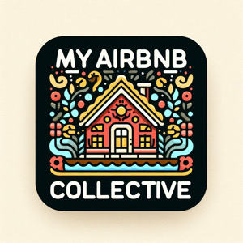

[View Site](https://my-airbnb-collective-57b00b515cab.herokuapp.com/)
---

## Contents

* [Validation Testing](#validation-testing)
    * [HTML](#html)
    * [CSS](#css)
    * [Javascript](#javascript)
    * [Python](#python)
    * [Lighthouse](#lighthouse)
* [Manual Testing](#manual-testing)
    * [Testing User Stories](#testing-user-stories)
    * [Full Testing](#full-testing)
* [Bugs](#bugs)
    * [Solved Bugs](#solved-bugs)
    * [Unsolves Bugs](#unsolved-bugs)

### Validation Testing
---

#### **HTML**

For all HTML validation I used [W3 Validator](https://validator.w3.org/)

---
**base.html / home.html**

When validating home page, I realised that there was a few problems concerning base.html.

With the favicon being given a bad value of 'favicon'. I switched the value instead to `<link rel="icon" type="image/png" href="{{ MEDIA_URL }}favicon.png">` which fixed the issue.

I also found an error with the meta tag, which showed a meta element with the http-equiv attribute whos value is X-UA-Compatible must have a content attribute with the value IE=edge.
The code was changed from `<meta name="viewport" content="width=device-width, initial-scale=1.0, shrink-to-fit=no">` to `<meta name="viewport" content="width=device-width, initial-scale=1, shrink-to-fit=no">`. It appeared the .0 was causing the issue added to initial scale.

From validator I found a div that was added and the form was not closed. This was because the div was above the form:

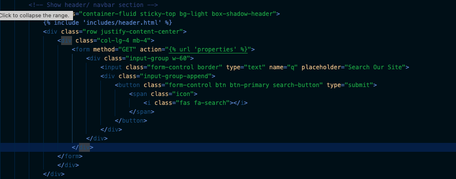

This was fixed by moving the div above the form and correcting the indentation:

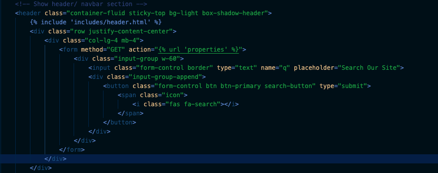

The last error was showing in base.html that I had added `type="text/javascript` in my postload js section. I removed this and passed all tests for base.html/ home.html

I added home.html to this section because these we're shown to me whilst viewing the home page. Once the errors we're removed in base.html, the home page showed no errors.

Issues

 
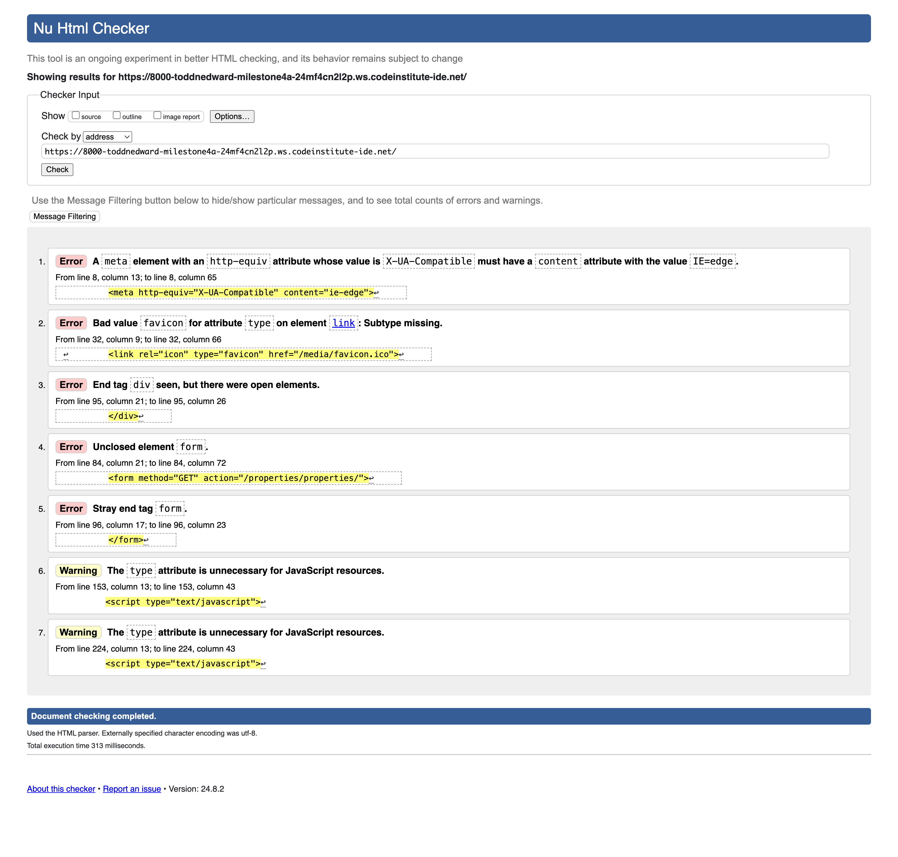

Fixed

 
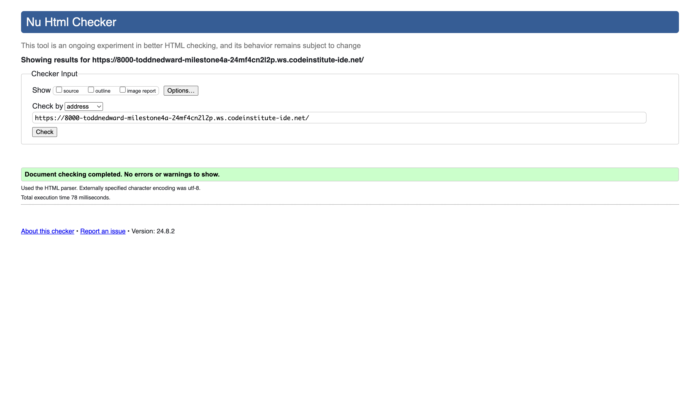

---

**Properties.html**

Properties showed no HTML issues. **Passed**

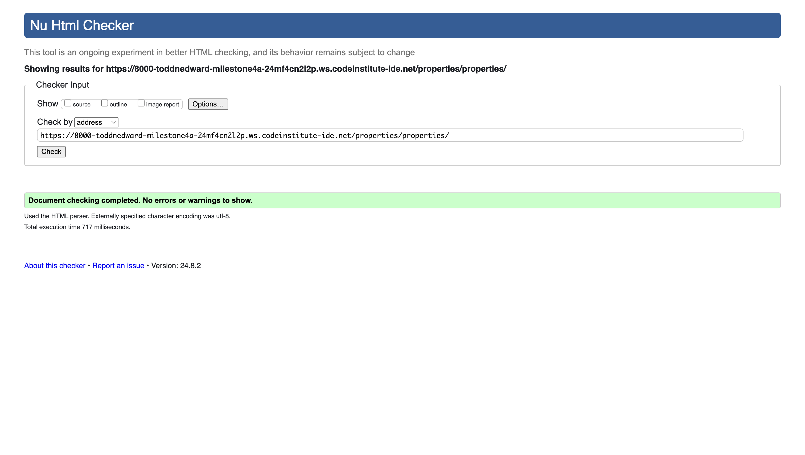

---

**Property_details.html**

Property details came back with errors mainly for trailing slashes, which I removed. These we're removed from all images, from daterangepicker.css, and a stray tag removed from line 235.
Type was also removed from all extra scripts too. The script tags we're also edited in the includes files for modal and datepicker scripts. After these we're fixed, all tests passed:

Issues

 
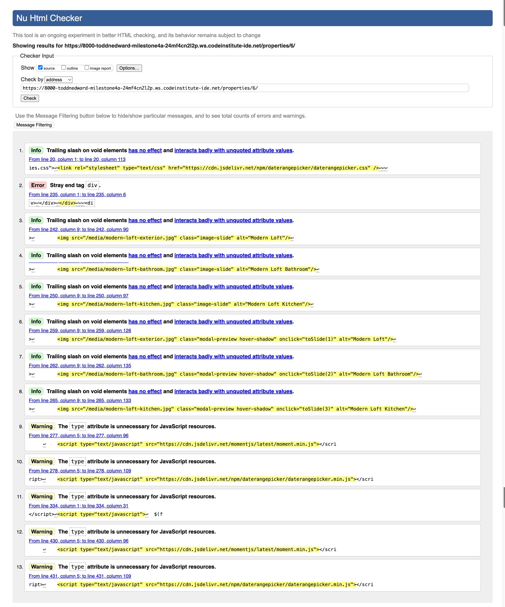

Fixed

 

---

**faqs.html**

FAQs page showed `stray end tag div on line 179`, which can be seen here:

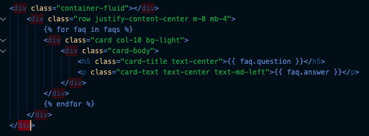

I realised this was because the container-fluid div on line 23 was closed with a `
` at the end. Once that was deleted, all tests we're passed

---

**contact.html**

Contact showed no HTML issues. **Passed**

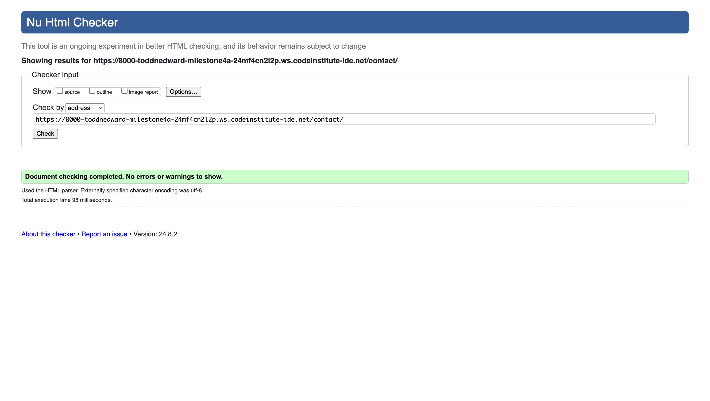

---

**Login.html**

Login showed no HTML issues. **Passed**

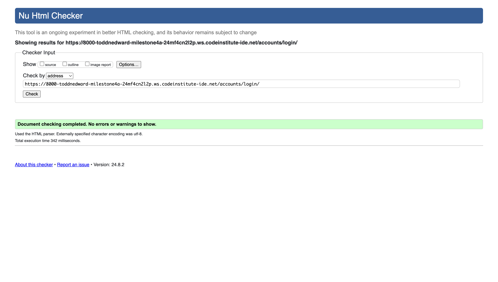

---

**Register.html**

Register page showed `Element ul not allowed as child of element small in this context. (Suppressing further errors from this subtree.)`, which can be seen here:

I realised this was because the container-fluid div on line 23 was closed with a `
` at the end. Once that was deleted, all tests we're passed

---

**Profile.html**

Because profile requires the user to be logged in, I could not validate the HTML content from the URL. I had to use text input to check instead. 
This gave me errors but we're all linked to variables (`{{ }}`) and tags/ filters (``) which I know we're formatted correctly so I classed this as passed as no HTML errors we're shown otherwise. The only other error was `Element head is missing a required instance of child element title.` but this had passed on previous URLs with the same format so I put it down to the interaction of django that the HTML validator was not seeing because of it being text input instead of URL to validate.

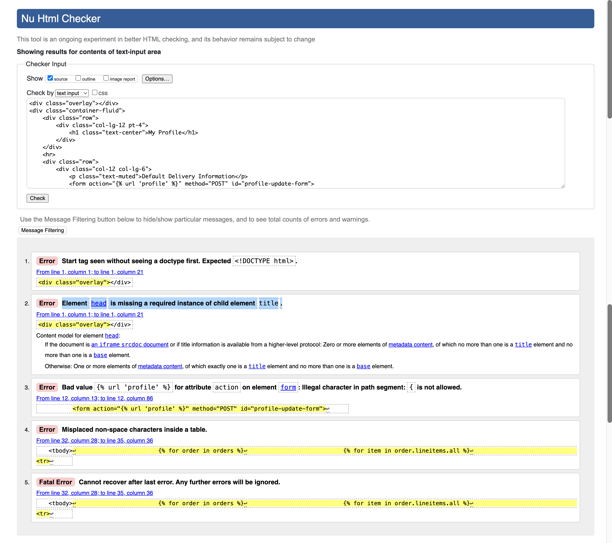

---

**Cart.html - URL Validation**

With validation I could only validate an empty cart which showed up the error ` The type attribute is unnecessary for JavaScript resources.` as seen here:

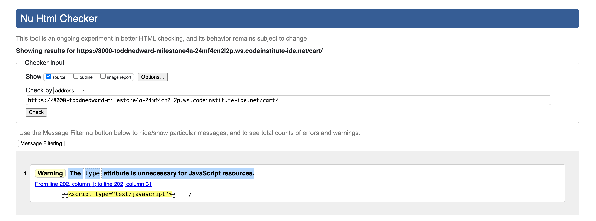

This was found on line 121 of cart.html:

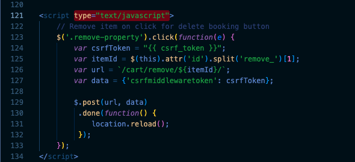

Once I removed `type="text/javascript"` all tests passed.

**Cart.html - Text Input Validation**

Because I could only check an empty cart with the URL, I decided to check again with text input. The errors it showed we're similar to profile.html only showing areas due to the tags, filters and variables being used within the code so I didn't see these to be an issue and concluded this also passed as the tags, filters and variables follow the correct layout.

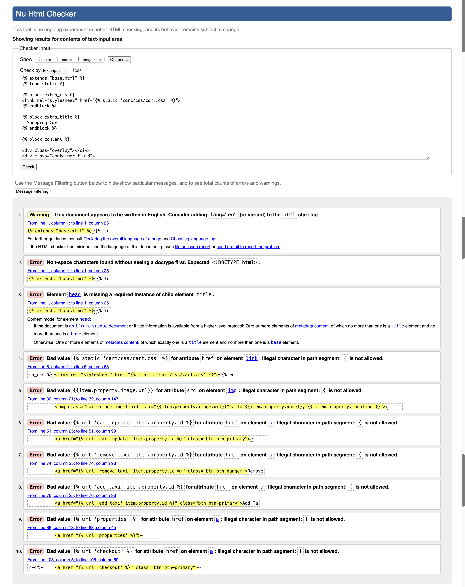

---

**Checkout.html - URL Validation**

Checkout URL validation showed no HTML issues. **Passed**

**Checkout.html - Text Input Validation**

Because I could only check an empty checkout with the URL, I decided to check again with text input. The errors again we're all related to tags, filters and variables, so I ignored them, but discovered that my H1 heading wasn't closed, so I added the closure on line 

---

**Edit_property.html - URL Validation**

Checked URL validation showed one error which was a space at the end of an element:

`Info: Trailing slash on void elements has no effect and interacts badly with unquoted attribute values.

From line 133, column 3; to line 133, column 65

iv>↩↩  ↩  <input type="hidden" name="next" value="/properties/edit/2/" />↩  ↩  `

This appeared to be from django's property.id passing through for editing the property, and this appeared to be correct still so was left alone. I checked this by looking through the directory of my code and searching for the code itself. As can be seen it does not exist in the code that i created so must be backend from django. This may also be caused as superuser/ admin needs to be logged in to view these pages.

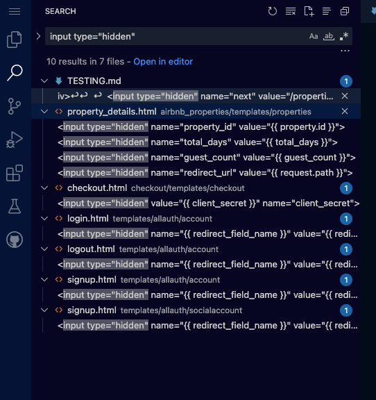

Here is result with the issue left:

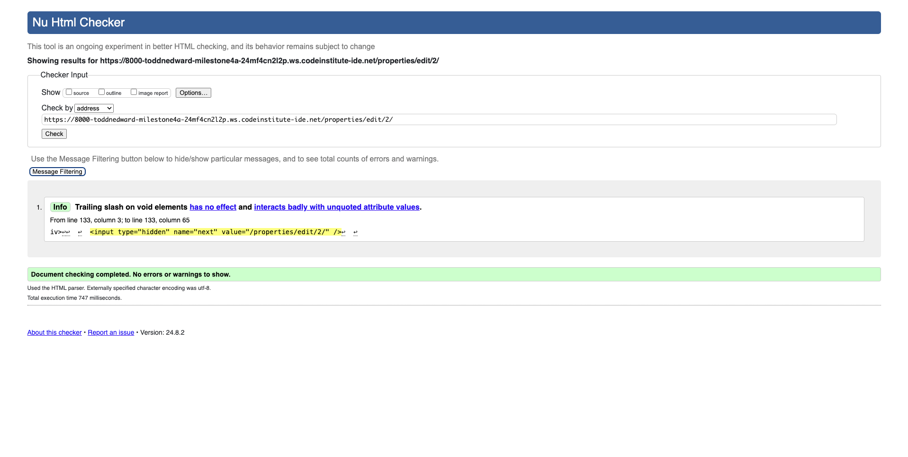

---

**Add_property.html - URL Validation**

Checked URL validation showed one error which was a space at the end of an element:

`Trailing slash on void elements has no effect and interacts badly with unquoted attribute values. This may also be caused as superuser/ admin needs to be logged in to view these pages.

From line 133, column 3; to line 133, column 62

iv>↩↩  ↩  <input type="hidden" name="next" value="/properties/add/" />↩  ↩  `

This gives the same error as 

Here is result with the issue left:

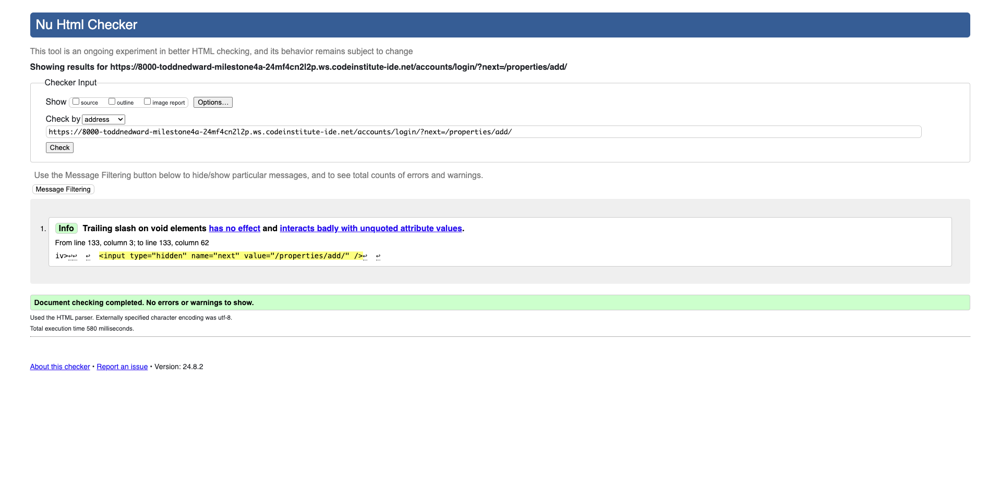

---

#### **CSS**

[W3C](https://jigsaw.w3.org/css-validator/) was used to validate CSS.

| File | Result | Evidence |
| :--- | :--- | :--- |
| static/base.css | Pass | [base.css](readme_testing_media/css_validation/base_css.png)|
| airbnb_properties/static/airbnb_properties/css/properties.css | Pass | [properties.css](readme_testing_media/css_validation/properties_css.png)|
| cart/static/cart/css/cart.css | Pass | [cart.css](readme_testing_media/css_validation/cart_css.png)|
| checkout/static/checkout/css/checkout.css | Pass | [checkout.css](readme_testing_media/css_validation/checkout_css.png)|

#### **Javascript**

[Code Beautify](https://codebeautify.org/jsvalidate) was used to validate Javascript.

| File | Result | Evidence |
| :--- | :--- | :--- |
| checkout/static/checkout/js/stripe_elements.js | One warning, but copied from [boutique Ado's code](https://github.com/Code-Institute-Solutions/boutique_ado_v1/blob/de7ad2067ac1b5de37a4cd8b9f4ddf572a4bf6c7/checkout/static/checkout/js/stripe_elements.js) | [stripe.js](readme_testing_media/js_validation/stripe_js.png)|
| home/templates/home/index.html | Failed (missing semicolon) | [carousel_js_error.js](readme_testing_media/js_validation/home_js_error.png)|
| home/templates/home/index.html | Passed (semicolon added to line 55) | [carousel_js_fixed.js](readme_testing_media/js_validation/home_js_fixed.png)|
| airbnb_properties/templates/includes/date_picker_script.html | Passed | [date_picker_script.js](readme_testing_media/js_validation/date_picker_js.png)|
| airbnb_properties/templates/includes/date_picker_script.html | Passed | [date_picker_script.js](readme_testing_media/js_validation/date_picker_js.png)|
| airbnb_properties/templates/includes/lightbox_script.html | Failed (unnecessary semicolons) | [light_box_js_error.js](readme_testing_media/js_validation/light_box_script_js_error.png)|
| airbnb_properties/templates/includes/lightbox_script.html | Passed (extra semicolons removed)| [light_box_js_fixed.js](readme_testing_media/js_validation/light_box_script_js_fixed.png)|

#### **Python**

[Code Institute Python Linter](https://pep8ci.herokuapp.com/) was used to validate Python.

| File | Result | Evidence |
| :--- | :--- | :--- |
| **airbnb_properties** |       |               |
| airbnb_properties/admin.py | Passed | [properties_admin.py](readme_testing_media/python_validation/properties_admin_python.png)|
| airbnb_properties/apps.py | Passed | [properties_apps.py](readme_testing_media/python_validation/properties_apps_python.png)|
| airbnb_properties/forms.py | Passed | [properties_forms.py](readme_testing_media/python_validation/properties_forms_python.png)|
| airbnb_properties/models.py | Passed | [properties_models.py](readme_testing_media/python_validation/properties_models_python.png)|
| airbnb_properties/urls.py | Passed | [properties_urls.py](readme_testing_media/python_validation/properties_urls_python.png)|
| airbnb_properties/views.py | Passed | [properties_views.py](readme_testing_media/python_validation/properties_views_python.png)|
| **cart** |       |               |
| cart/apps.py | Passed | [cart_apps.py](readme_testing_media/python_validation/cart_apps_python.png)|
| cart/contexts.py | Passed | [cart_contexts.py](readme_testing_media/python_validation/cart_contexts_python.png)|
| cart/urls.py | Passed | [cart_urls.py](readme_testing_media/python_validation/cart_urls_python.png)|
| cart/views.py | Passed | [cart_views.py](readme_testing_media/python_validation/cart_views_python.png)|
| **checkout** |       |               |
| airbnb_properties/admin.py | Passed | [checkout_admin.py](readme_testing_media/python_validation/checkout_admin_python.png)|
| airbnb_properties/apps.py | Passed | [checkout_apps.py](readme_testing_media/python_validation/checkout_apps_python.png)|
| airbnb_properties/forms.py | Passed | [checkout_forms.py](readme_testing_media/python_validation/checkout_forms_python.png)|
| airbnb_properties/models.py | Passed | [checkout_models.py](readme_testing_media/python_validation/checkout_models_python.png)|
| airbnb_properties/signals.py | Passed | [checkout_signals.py](readme_testing_media/python_validation/checkout_signals_python.png)|
| airbnb_properties/urls.py | Passed | [checkout_urls.py](readme_testing_media/python_validation/checkout_urls_python.png)|
| airbnb_properties/webhook_handler.py | Passed | [checkout_webhook_handler.py](readme_testing_media/python_validation/checkout_webhook_handler_python.png)|
| airbnb_properties/webhooks.py | Passed | [checkout_webhooks.py](readme_testing_media/python_validation/checkout_webhooks_python.png)|
| **contact** |       |               |
| contact/apps.py | Passed | [contact_apps.py](readme_testing_media/python_validation/contact_apps_python.png)|
| contact/forms.py | Passed | [contact_forms.py](readme_testing_media/python_validation/contact_forms_python.png)|
| contact/models.py | Passed | [contact_models.py](readme_testing_media/python_validation/contact_models_python.png)|
| contact/urls.py | Passed | [contact_urls.py](readme_testing_media/python_validation/contact_urls_python.png)|
| contact/views.py | Passed | [contact_views.py](readme_testing_media/python_validation/contact_views_python.png)|
| **contact** |       |               |
| faqs/admin.py | Passed | [faqs_admin.py](readme_testing_media/python_validation/faqs_admin_python.png)|
| faqs/apps.py | Passed | [faqs_apps.py](readme_testing_media/python_validation/faqs_apps_python.png)|
| faqs/models.py | Passed | [faqs_models.py](readme_testing_media/python_validation/faqs_models_python.png)|
| faqs/urls.py | Passed | [faqs_urls.py](readme_testing_media/python_validation/faqs_urls_python.png)|
| faqs/views.py | Passed | [faqs_views.py](readme_testing_media/python_validation/faqs_views_python.png)|
| **contact** |       |               |
| home/apps.py | Passed | [home_apps.py](readme_testing_media/python_validation/home_apps_python.png)|
| home/urls.py | Passed | [home_urls.py](readme_testing_media/python_validation/home_urls_python.png)|
| home/views.py | Passed | [home_views.py](readme_testing_media/python_validation/home_views_python.png)|
| **myairbnb_collective** |       |               |
| myairbnb_collective/asgi.py | Passed | [myairbnb_collective_settings.py](readme_testing_media/python_validation/myairbnb_collective_asgi_python.png)|
| myairbnb_collective/settings.py | Passed | [myairbnb_collective_settings.py](readme_testing_media/python_validation/myairbnb_collective_settings_python.png)|
| myairbnb_collective/urls.py | Passed | [myairbnb_collective_urls.py](readme_testing_media/python_validation/myairbnb_collective_urls_python.png)|
| myairbnb_collective/wsgi.py | Passed | [myairbnb_collective_wsgi.py](readme_testing_media/python_validation/myairbnb_collective_wsgi_python.png)|
| **user_profile** |       |               |
| user_profile/apps.py | Passed | [user_profile_apps.py](readme_testing_media/python_validation/user_profile_apps_python.png)|
| user_profile/forms.py | Passed | [user_profile_forms.py](readme_testing_media/python_validation/user_profile_forms_python.png)|
| user_profile/models.py | Passed | [user_profile_models.py](readme_testing_media/python_validation/user_profile_models_python.png)|
| user_profile/urls.py | Passed | [user_profile_urls.py](readme_testing_media/python_validation/user_profile_urls_python.png)|
| user_profile/views.py | Passed | [user_profile_views.py](readme_testing_media/python_validation/user_profile_views_python.png)|
| **custom_storages** |       |               |
| custom_storages/apps.py | Passed | [custom_storages.py](readme_testing_media/python_validation/custom_storages_python.png)|
| **manage** |       |               |
| manage/apps.py | Passed | [manage.py](readme_testing_media/python_validation/manage_python.png)|

#### **Lighthouse**

[Google's Lighthouse](https://developer.chrome.com/docs/lighthouse/overview) was used to test performance, accessibility, best and practices and SEO for the site.

**Results**

| Page | Result | Notes |
| :--- | :--- | :--- |
| Home Page |  | Lighthouse showed no labels added to search icon and shopping cart icon. Aria labels added to both.   |
| Properties Page |  | Performance lower due to large number of images   |
| Property Details Page |  | SEO low due to majority of text being provided by tags.   |
| Cart Page |  | Bootstrap buttons showed accessibility issue. Decided to keep the same as it is a default in bootstrap used regularly on websites.   |
| Checkout Page |  | Bootstrap buttons showed accessibility issue. Decided to keep the same as it is a default in bootstrap used regularly on websites.   |
| Checkout Success Page |  | Bootstrap buttons showed accessibility issue. Decided to keep the same as it is a default in bootstrap used regularly on websites. Tags caused lower SEO score again.  |
| FAQs Page |  | Passed |
| Contact Us Page |  | Passed |
| Profile Page |  | Passed |

I found some results could be better, but was mainly down to bootstrap classes that already exist as a default, so I didn't find the need to change these as they're the recommended settings by bootstrap and are used on numerous sites. Doing the lighthouse test made me add aria labels to the anchor image in checkout and also to the shopping cart and search icons in the header section. It gave me a warning about repeating header elements which I did in footer, but I've also seen this on several sites, including the boutique ado tutorial by code institute so I didn't see the need to change it.

---

### Manual Testing
---

#### **Testing User Stories**

| As a... | I want to... | So I can... | How this is achieved | Evidence |
| :--- | :--- | :--- | :--- | :--- |
| **Viewing and Navigation** |
| Shopper | Easily navigate the site | Find properties and information quickly | A navbar is at the top of the page, providing links to all pages for the user to find quickly. | [Main Nav](/readme_testing_media/user_stories/main_nav.png)  [Mobile Nav](/readme_testing_media/user_stories/nav_mobile.png) |
| Shopper | View more information about the property from properties page | See if the property I like is suitable for my needs, if its available to book and other criteria like do they allow pets etc. | Click on the image of the chosen property or the 'find out more' button. Both options direct the user to the property details page. | [Property Details link ](/readme_testing_media/user_stories/property_links.png)  [Mobile Property Details link](/readme_testing_media/user_stories/mobile_property_links.png) |
| Shopper | Choose dates I want to visit the property, and how many guests | See availability of the property, if it has the dates I would like to visit, confirm the dates so I can add the property to cart. | Datepicker is provided on the property details page. If clicked, it shows a calendar. Unavailable dates are shown in red to the user so it can't be double booked. Guest count dropdown is also shown on property details page. |[Property Details Choices ](/readme_testing_media/user_stories/property_details_choices.png)  [Property Details calendar](/readme_testing_media/user_stories/property_details_calendar.png) [Property Details choices mobile](/readme_testing_media/user_stories/property_details_choices_mobile.png)|
| Shopper | View my cart in full detail | Make sure the items I have chosen have the correct details, and be able to edit or delete the properties from my cart | Cart page allows user to see all cart items in seperate containers for accessibility. They include all details for the booking including property details, the date range, total number of days the user is staying and a breakdown of costs. Grand total takes all totals into account from all properties and for taxi fares also. | [Cart Full View ](/readme_testing_media/user_stories/cart_full_view.png)  [Mobile Shopping Cart](/readme_testing_media/user_stories/cart_full_view_mobile.png) |
| Shopper | Edit/ delete properties in cart | make amendments to my bookings if I need to change the date range or how many days and how many guests are staying etc. Delete from cart if I accidentally added item or changed my mind. | Edit property button is provided on full cart view which redirects to property details page with prior information (date range and guest count) autofilled for them to adjust or check. Delete button also on cart full view that when clicked brings up a modal for the user to confirm they would like to delete the potential or cancel. If confirmed, property is removed from the cart. | [Cart Full View Edit/ Delete Property ](/readme_testing_media/user_stories/cart_full_view.png)  [Mobile Shopping Cart Edit/ Delete Property](/readme_testing_media/user_stories/cart_full_view_mobile.png) |
| Shopper | See Frequently Asked Questions | Find answers to enquiries that I may have about how the site works without having to contact the company and waiting for an answer. | In the navbar is the 'FAQs' link. When the user clicks, it takes them to the frequently asked questions page. | [FAQs Page](/readme_testing_media/faqs_page.png) |
| Shopper | Contact the company | Get an answer to enquiry I may have or a problem with a current order. | In the navbar is the 'Contact Us' link. When the user clicks, it takes them to the contact us page with a contact form. Alternatively, in the footer section, an email address, phone number, and extra link to contact form is available as well as links to social media pages. | [Contact Us Page](/readme_testing_media/contact_us_page.png) [Footer Links](/readme_testing_media/footer-fullscreen.png) [Footer Links Mobile](/readme_testing_media/footer-mobile.png)|
| **Registration & User Accounts** |
| Shopper | Register an account | Save my details for future bookings and view order history | In nav bar, register link is provided for user to click on. Once clicked, user will be directed to registration form, which will create an account. | [Register link ](/readme_testing_media/user_stories/register.png)  [Mobile Register link](/readme_testing_media/user_stories/register_mobile.png) [Register Form](/readme_testing_media/user_stories/register_form.png)|
| Shopper | Receive an email to verify registration | Confirm my email address is correct and verify my account to use. | Verification email is sent once user has registered an account. | [Receive Verification Email](/readme_testing_media/user_stories/email_confirmation.png) |
| Shopper | Log in and out of account | Log in to retreive my information and make another purchase quicker. Logging out to keep my details secure. | In the 'my account' dropdown section, log in is shown. When the user is logged in this changes to logout so the user can securely log out of their account also. This takes the user to another page to confirm they would like to logout of their account. | [Login / Logout ](/readme_testing_media/user_stories/login_logout_section.png) |
| Shopper | View my profile | See my personal details and order history | In the 'my account' dropdown, once the user is logged in, they can view their profile. This is only showed when user is logged in for security. When they click on the link, they are taken to the profile page, where they can view their details. | [User Profile ](/readme_testing_media/profile_page.png)  [User Profile Mobile](/readme_testing_media/user_stories/profile_mobile.png) |
| Shopper | Reset my password | Create a new password incase I have forgotten my current one or wish to update it. | During login, a forgotten password is shown. | [Password Reset](/readme_testing_media/user_stories/password_reset.png) |
| **Sorting & Searching** |
| Shopper | Search properties on the site | Find properties and categories quickly, so I don't have to look through all properties to find the criteria I'm looking for | Search bar is at the top of each page that redirects to the properties page with the relevant search criteria searched. | [Search Bar ](/readme_testing_media/user_stories/main_nav.png)  [Mobile Search Bar](/readme_testing_media/user_stories/nav_mobile.png) |
| Shopper | Filter properties on the site | Find properties and categories quickly, so I don't have to look through all properties to find the criteria I'm looking for | Sorting filter is available on the properties page to search through price, category, number of bedrooms etc. | [Filter section ](/readme_testing_media/user_stories/filter.png)  [Mobile Filter Section](/readme_testing_media/user_stories/filter_mobile.png) |
| Shopper | View properties I have added to cart and see totals | Make sure I'm not over my budget or to make sure I've chosen the correct properties whilst I carry on shopping. | Shopping cart is shown in the top right corner of large view and in navbar in mobile view. If something is in the cart, the colour changes from blue to green showing the user there has been a change to the cart. If they click on the shopping cart view it takes them to the cart page, showing all details and breakdowns of the booking details they have chosen. | [Shopping Cart ](/readme_testing_media/user_stories/shopping_cart.png)  [Mobile Shopping Cart](/readme_testing_media/user_stories/shopping_cart_mobile.png) |
| **Making Purchases** |
| Shopper | Add taxi from airport in cart for my potential booking | Save time having to book a taxi seperately and have the convenience of doing it on the site so all my booking is in one place | Add taxi section visible on cart page. This explains the taxi fare and asks if the user would like to add this option. If they do, they can click on the add taxi button. This button appends taxi_price to their cart, which then shows the text taxi added and the fare too. If they change their mind, once clicked the button changes to remove taxi and will revert back to no taxi booking once they click it. | [Cart Full View Add/ Remove Taxi ](/readme_testing_media/user_stories/cart_add_taxi.png)  [Mobile Shopping Cart Add/ Remove Taxi](/readme_testing_media/user_stories/mobile_cart_add_taxi.png) |
| Shopper | Proceed to checkout | Purchase the items added to my cart | 'Secure Checkout' button at the bottom of cart page. Once clicked, user is recirected to checkout page | [Checkout button ](/readme_testing_media/user_stories/cart_add_taxi.png) |
| Shopper | Know my personal details are secure in checkout | Not worry about my personal details being shared | Stripe is used for checkout information. Checkout success page also requires the user to be authenticated to view the information. Another user is told they don't have permission to view that page if they use the specific URL to search for the user's details. | [Stripe Checkout](/readme_testing_media/checkout_page.png)|
| **Admin & Store Management** |
| Admin/ Owner | Login to website | Make adjustments to properties or add properties for future expansion of site. | Admin uses 'my account' section same as regular user with admin login details which will give them access, along with extras that only admin can see such as manage property and add property. | [Stripe Checkout](/readme_testing_media/user_stories/login_logout_section.png)|
| Admin/ Owner | Edit property details | Adjust details of a property to be able to update pricing, more specific location, change facilities availability if a property begins to allow pets at the property etc. | Admin uses 'my account' section and chooses property management from the dropdown section. This will take them to the properties page, which now include the buttons for edit and delete properties. Once they click on the property they want to edit, they will be taken to the page where they can make amendments, then either update information or cancel if they decide they've made errors or it no longer needs updating. | [Properties Admin View Page](/readme_testing_media/user_stories/properties_admin_view.png) [Properties Admin View Mobile Page](/readme_testing_media/user_stories/properties_admin_mobile.png) [Edit Property Page](/readme_testing_media/edit_property_page.png) [Edit Property Mobile Page](/readme_testing_media/user_stories/edit_property_admin.png)|
| Admin/ Owner | Add property | Add a new property to the site | In 'my account' dropdown in navbar, admin can choose 'add property' which directs them to the add property page. From here they can create a new listing using the same layout from edit property for consistency when they add a new product. | [Add Property Page](/readme_testing_media/user_stories/admin_add_property.png) [Add Property Page Mobile](/readme_testing_media/user_stories/admin_add_property_mobile.png)|
| Admin/ Owner | Delete property | Remove a property from the site incase a property owner no longer wishes to be on the site or it becomes unavailable. | On properties and edit property pages, admin can see 'delete' buttons that when clicked will open a modal to ask the admin to confirm their decision to delete the property. Once they've confirmed, it will be removed from the website. | [Delete Property Page](/readme_testing_media/user_stories/properties_admin_view.png) [Delete Property Page Mobile](/readme_testing_media/user_stories/delete_property_button_mobile.png) [Delete Property Modal](/readme_testing_media/user_stories/delete_property_modal_mobile.png) [Delete Property Modal Mobile](/readme_testing_media/user_stories/delete_property_modal.png)|
| Admin/ Owner | Login to admin section | Control all aspects of the website in one place, including property details, categories, orders, users, groups, add frequently asked questions. | Admin goes to 'https://my-airbnb-collective-57b00b515cab.herokuapp.com/admin/' and can login and manage from the web page. | [Admin Page](/readme_testing_media/user_stories/admin_page.png) [Admin Properties Page](/readme_testing_media/user_stories/admin_properties.png)|

#### **Full Testing**

Full testing was performed on the following devices:

* Mobile
    * Samsung Galaxy S21 FE
    * Samsung Galaxy S23
* Tablet
    * Ipad Air 2
* Laptop
    * Macbook Pro M1 14 inch
* Desktop
    * Mac Pro with 27 inch screen

[Google Lighthouse](https://developer.chrome.com/docs/lighthouse/overview) was also used to test on several screen sizes as well as using responsive mode.

Testing was performed on the following browsers:

* Google Chrome (Version 127.0.6533.89)
* Microsoft Edge (Version 126.0.2592.102)
* Apple Safari (Version 17.5)

| Feature | Expected Outcome | Testing Performed | Result | Evidence | Outcome |
| :--- | :--- | :--- | :--- | :--- | :--- |
| **Navbar** |
| Sticky Navbar section | Navbar should follow user as they scroll down the page so its always easily accessible. | Scrolled down page on both mobile and full screen device to check if navbar followed down the page | Navbar stays at the top of the page whilst user scrolls down | [Sticky header/ navbar](/readme_testing_media/full_testing/sticky_navbar.png) | Pass |
| Links | All links in navbar should take the user to the appropriate page | Clicked on each link in navbar on mobile and full view to check if all links go to the corresponding pages. | All links go to correct pages | [Navbar Links](/readme_testing_media/full_testing/navbar_links.png) | Pass |
| 'My Account' Dropdown | My account dropdown section should show login/register when user not logged in | Logged out of account and checked dropdown menu  | Only Login/Register shown | [Login/Register dropdown](/readme_testing_media/user_stories/register.png) | Pass |
|          | When user logged in, 'my account' dropdown should show 'my profile' and 'logout' | Created a user account and logged in. Checked 'my account' dropdown menu. | Correct links shown | [User logged in dropdown](/readme_testing_media/full_testing/logged_in_myaccount.png) | Pass |
| Search Bar | Should show up in navbar on full screen and mobile in navbar | Went to home page | Search bar shown |[search bar view](/readme_testing_media/navbar-fullscreen.png) [search bar view mobile](/readme_testing_media/navbar-mobile-open.png) | Pass |
|            | Search terms such as property name, location or category should filter through properties to show user only properties matching criteria | Typed in different search criteria, including name of property (manor), location (birmingham) and category (city) | All results we're filtered to correct results. | [search property name](/readme_testing_media/full_testing/search_name.png) [search property location](/readme_testing_media/full_testing/search_location.png) [search property category](/readme_testing_media/full_testing/search_category.png) | Pass |
|            | Should become full width of screen in mobile view and underneath the hamburger icon | Tested with [Google Lighthouse](https://developer.chrome.com/docs/lighthouse/overview) responsive and on mobile phone. | Search bar expands to full screen width | [search bar view mobile](/readme_testing_media/navbar-mobile-open.png) | Pass |
| Cart Icon | Should direct to cart page when clicked | Added an item to cart and clicked on cart icon | Directed to cart page | [cart icon green](/readme_testing_media/cart_page.png) | Pass |
|           | Should change colour from blue to green when an item is added to the cart | Added an item to cart | Cart icon changed from blue to green | [cart icon green](/readme_testing_media/cart_page.png) | Pass |
| Navbar Responsiveness | Should turn into hamburger style menu when downsized to mobile sized devices | Tested on mobile phone and used [Google Lighthouse](https://developer.chrome.com/docs/lighthouse/overview) to check responsiveness | Navbar changed to mobile view including hamburger menu style. | [Nav full screen view](/readme_testing_media/navbar-fullscreen.png) [Nav mobile screen view](/readme_testing_media/navbar-mobile-open.png) | Pass |
| **Footer** |
| Main website links | Should show main links to site for easy access to the user if they're at the bottom of the page instead of by the footer | Added an item to cart | Cart icon changed from blue to green | [footer explore section](/readme_testing_media/full_testing/footer_explore.png) | Pass |
| Social Media links | Show social media links successfully take the user to the corresponding social media platform | Clicked on each link | All links successfully take the user to the correct social media platform url. | [footer social media section](/readme_testing_media/full_testing/footer_social.png) | Pass |
|                    | Should open a new page rather than redirecting away from the current website so user's still have the websites url open. | Clicked on each link | All links successfully open a new page rather than redirecting the current page. | [footer social _blank success](/readme_testing_media/full_testing/footer_blank.png) | Pass |
| Contact Us links | Contact form link should take the user to the contact us page. | Clicked on contact form link | Directed to contact us page. | [footer contact form](/readme_testing_media/full_testing/contact_code.png) | Pass |
|                  | Email link opens user's email and autofills the 'to' field in send email with the correct email address | Clicked on email link | Opens apple mail and autofills 'to' section. | [footer email](/readme_testing_media/full_testing/footer_email.png) | Pass |
|                  | Phone link opens on user's device to make a call to the number or facetime if on apple/mac | Clicked on phone link on macbook pro and on mobile device. | Opens facetime on macbook pro, opened call function on mobile device | [footer email](/readme_testing_media/full_testing/footer_email.png) [footer email mobile device](/readme_testing_media/full_testing/footer_phone_mobile.jpeg) | Pass |
| Footer Responsiveness | All three sections (explore, social media, and contact) should be in a row on larger devices. On mobile devices it should become full screen width for each section. | Tested on mobile phone and used [Google Lighthouse](https://developer.chrome.com/docs/lighthouse/overview) to check responsiveness | Footer changed from being 3 columns in a row to being full width for each section when on mobile device view. | [Footer full screen view](/readme_testing_media/footer-fullscreen.png) [Nav mobile screen view](/readme_testing_media/footer-mobile.png) | Pass |
| **Home Page** |
| Carousel functionality | Images shown on home page should move on a carousel between 5 images. | Watched the home page to see changes (on different browsers to check for issues) | All images successfully shown in carousel. | [Carousel image 1](readme_testing_media/home_page.png) [Carousel image 2](readme_testing_media/full_testing/home_page_carousel_two.png)| Pass |
| Carousel responsiveness | Carousel images should be responsive dependent on screensize of device | Tested on mobile phone and used [Google Lighthouse](https://developer.chrome.com/docs/lighthouse/overview) to check responsiveness | all images responsive | [Carousel image 1](readme_testing_media/full_testing/home_page_mobile.png) | Pass |
| 'View Our Properties' Link | Link should direct user to properties page | Clicked on the link | Link works successfully |  | Pass |
| **Properties Page** |
| Filter Dropdown | Filter dropdown should show different options for filtering when clicked. | Clicked on dropdown | Dropdown works | [Filter dropdown](readme_testing_media/user_stories/filter.png) [Filter dropdown mobile view](readme_testing_media/user_stories/filter_mobile.png) | Pass |
|                     | Filter should show corresponding options when clicked | Clicked on each option | All options work correctly and sort the properties accordingly. | [Filter A-Z](readme_testing_media/full_testing/filter_az.png) [Filter Z-A](readme_testing_media/full_testing/filter_za.png) [Filter Price Low-High](readme_testing_media/full_testing/filter_pricelow.png) [Filter Price High-Low](readme_testing_media/full_testing/filter_pricehigh.png) [Filter Category A-Z](readme_testing_media/full_testing/filter_category_az.png) [Filter Category Z-A](readme_testing_media/full_testing/filter_category_za.png) [Filter Bedrooms Low-High](readme_testing_media/full_testing/filter_bedroomslow.png) [Filter Bedrooms High-Low](readme_testing_media/full_testing/filter_bedroomshigh.png) | Pass |
| Property details | All properties should be displayed with an image, name, location, price per night and number of bedrooms | Viewed on different devices | All details shown for all properties | [Property details](readme_testing_media/properties_page.png) [Property details mobile view](readme_testing_media/full_testing/property_details_mobile.png) | Pass |
| Links to property details working | All images when clicked on should open property details page specific to the property id. 'Find out more' button should also direct to the same page. | Clicked on images and find out more button on several properties | All 'find out more' buttons and image links working successfully. | [Image/ button links](readme_testing_media/full_testing/property_links.png) | Pass |
| **Property Details Page** |
| Lightbox modal for images | When any of the three images at the top are clicked, the images should open in a lightbox so the user can see the pictures in a larger view and look through all three of the pictures on a carousel. | Viewed on different devices | Modal worked for all images | [Property details lightbox](readme_testing_media/full_testing/property_details_modal.png) | Pass |
| Lightbox modal responsiveness | Lightbox modal should be responsive on all devices | Viewed on different devices | Modal worked and resized for all devices | [Property details lightbox mobile view](readme_testing_media/full_testing/property_details_modal_mobile.png) | Pass |
| Facilities | If facilities exist in the model, they should appear as available in the facilities section. If available, the icon will appear blue, if not available they will appear red. | Compared the facilities shown on property details page with the fixtures to check details matched. | All facilities showed correct and corresponded with the fixtures. | [Property details - City Apartment facilities ](readme_testing_media/full_testing/facilities.png) [Property details - City Apartment fixtures](readme_testing_media/full_testing/fixtures.png)| Pass |
| Details    | All details should be shown on the property details page, including name, location, price per night, bedrooms, facilities, description and full description | Viewed several properties to view details | All details shown | [Property details - City Apartment facilities ](readme_testing_media/property_details_page.png) | Pass |
| Date Picker    | User should be able to choose a date range from the calendar dropdown. | Opened on different devices | Opened on all devices | [Date picker view ](readme_testing_media/full_testing/date_picker.png) | Pass |
|                | Date picker should show all unavailable dates with red background and be disabled so users can't choose those dates | Made a booking to block dates, then tried to book again on the same date. Tried to click on the dates but was disabled | Booked dates we're disabled and have a red background | [Date picker view ](readme_testing_media/full_testing/date_picker_blocked.png) | Pass |
|                | Date picker should be responsive on all devices | Tested on different devices and [Google Lighthouse](https://developer.chrome.com/docs/lighthouse/overview) responsiveness | Datepicker works on all devices | [Date picker responsive ](readme_testing_media/full_testing/date_picker_responsive.png) | Pass |
| Guest Count    | User should be able to open dropdown from guest count and choose amount of guests to stay at the property | Clicked on guest count and added different values. Guest count is correct on all properties (guest count = bedrooms x 2) | Guest count allows user to choose number of guests staying at property | [Guest count ](readme_testing_media/full_testing/guest_count.png) | Pass |
| Go to checkout/ cart    | User should be able to continue to cart view and checkout after choosing the details for the property the would like to book using the 'Go To Checkout' button. | Clicked on 'go to checkout' button after choosing details. | Button successfully takes user to cart with details from property details added. | ['go to checkout' button before clicking](readme_testing_media/full_testing/cart_button_before.png) ['go to checkout' button after clicking](readme_testing_media/full_testing/cart_button_after.png)| Pass |
| Toast Messages    | When user clicks go to checkout, they should see a toast message confirming message has been added to cart. | Added item to cart | Toast message was shown | [Toast Message Added to cart successful](readme_testing_media/full_testing/add_to_cart_success_message.png) | Pass |
| **Cart Page** |
| See cart contents    | User should be able to see items they've added to their cart with the corresponding details they have added such as date range and amount of guests | Added item to cart to see the corresponding values for guest count and date_range | All details shown correctly in cart | [details passed to cart for details confirmation](readme_testing_media/full_testing/cart_button_before.png) [chosen details in cart.html](readme_testing_media/full_testing/cart_button_after.png) | Pass |
| Edit Booking    | User should be able to click on the button 'edit booking' and be able to change the current item. | Clicked on edit booking button | was redirected back to property details page displaying the details appended from the cart section (guest count and date range) | [Edit booking button](readme_testing_media/full_testing/edit_delete_booking_button.png) [Appended details in property details when clicked](readme_testing_media/full_testing/edit_booking_appended.png) | Pass |
| Delete Booking    | User should be able remove cart item by clicking on the 'delete booking button' | Clicked on delete booking button | Was directed to a modal that asked me to confirm the deletion. When I clicked delete, it removed the item from cart. | [Delete booking button](readme_testing_media/full_testing/edit_delete_booking_button.png) [Delete Booking Modal](readme_testing_media/full_testing/delete_booking.png) | Pass |
| Add Taxi Button    | When user clicks on 'add taxi' button, taxi price should be added to grand total, and a paragraph line should be appended showing taxi price in property details list in cart. Button should turn to red background and display 'remove taxi' instead to revert back to no taxi added to booking. | Clicked on 'add taxi' button | Taxi was added to property details. 'add taxi' button turned red and displayed 'remove taxi' instead. | [add taxi button](readme_testing_media/full_testing/add_taxi_button.png) | Pass |
| Remove Taxi Button    | When user clicks on 'remove taxi' button, taxi price should be removed from grand total, and a paragraph line showing taxi price in property details list in cart should be removed. Button should turn back to blue background and display 'add taxi' again. | Clicked on 'remove taxi' button | Taxi was removed from property details. 'remove taxi' button turned blue and displayed 'add taxi' instead. | [remove taxi button](readme_testing_media/full_testing/remove_taxi.png) | Pass |
| Toast Messages    | When user deletes item from cart, they should see a toast message confirming removal | Deleted item from cart | Toast message was shown | [Toast Message Delete Booking](readme_testing_media/full_testing/delete_booking_message.png) | Pass |
|                   | When user clicks add taxi button, toast message should show to confirm taxi added to cart | Added taxi to cart | Toast message was shown | [Toast Message Taxi Added](readme_testing_media/full_testing/taxi_added_toast.png) | Pass |
|                   | When user clicks remove taxi button, toast message should show to confirm taxi removed from cart | Removed taxi from cart | Toast message was shown | [Toast Message Taxi Removed](readme_testing_media/full_testing/taxi_removed_toast.png) | Pass |
| 'secure checkout' button | When user clicks secure checkout button, they are redirected to checkout page | Clicked on secure checkout | Was redirected to checkout page | [secure checkout button](readme_testing_media/full_testing/secure_checkout_button.png) [redirect to checkout page](readme_testing_media/full_testing/checkout_redirect.png) | Pass |
| Responsiveness | Cart page should be readable and designed for all devices. | Tested on mobile phone and using [Google's Lighthouse](https://developer.chrome.com/docs/lighthouse/overview) to check layout and responsiveness | Passed on all devices. | [Cart responsiveness- Full Screen](readme_testing_media/full_testing/cart_responsive_full.png) [Cart responsiveness- Mobile Screen](readme_testing_media/full_testing/cart_responsive_mobile.png) | Pass |
| **Checkout Page** |
| Details | Be able to see all details about my booking on the page | Visited checkout after clicking on secure checkout. Viewed information displayed | All necessary information shown | [Checkout details](readme_testing_media/full_testing/checkout_responsive_full.png) | Pass |
| Form required validation | User should be told they are required to fill in all forms with '*' next to the form label. | Clicked on all with required box then clicked checkout to show box reminder to fill in information and not allow me to continue to proceed to payment | [Form required validation](readme_testing_media/full_testing/checkout_required_form.png) | Pass |
| Login/ Register link | User should be able to click on links on form to create an account or login to save personal information. | Clicked on both links to make sure they went to the corresponding links | Both links when clicked went to corresponding  | [login/ register links](readme_testing_media/full_testing/login_register_links.png) | Pass |
| Personal Details | Be able to fill in form for personal details | Filled in all fields | All form inputs allowed data input | [Checkout details](readme_testing_media/full_testing/checkout_form.png) | Pass |
|                  | Be able to save personal details for faster future purchases | Logged in and clicked box to save personal details. Clicked proceed to payment to initiate save profile function. | Personal details updated to profile | [Save Personal Details](readme_testing_media/full_testing/checkout_form.png) [Saved Personal Details In Profile](readme_testing_media/full_testing/checkout_save_details.png) | Pass |
|                  | Be able to see personal information autofilled in form next time I go to checkout after saving details on previous transaction. | Whilst still logged in, added another property to cart and proceeded to checkout to see if personal information was filled in. | Personal details successfully in checkout form | [Checkout autofill personal information](readme_testing_media/full_testing/checkout_autofill_info.png) | Pass |
| Responsiveness | Cart page should be readable and designed for all devices. | Tested on mobile phone and using [Google's Lighthouse](https://developer.chrome.com/docs/lighthouse/overview) to check layout and responsiveness | Because I was using a table format, this became very squashed when moving to smaller devices. I decided to have the coding in this section different to only be displayed on tablet and mobile phones to cover full screen which now looks professional and not hard to read. | [Checkout responsiveness- Full Screen](readme_testing_media/full_testing/checkout_responsive_full.png) [Checkout responsiveness- Mobile Screen Top](readme_testing_media/full_testing/checkout_responsive_mobile_1.png) [Checkout responsiveness- Mobile Screen Bottom](readme_testing_media/full_testing/checkout_responsive_mobile_2.png) | Pass |
| Payment Information | If user enters incorrect information, they are prompted with a message that displays the corresponding message with the error from stripe. | Entered incorrect information in payment bar | Error message shown successfully |[Incorrect payment information message](readme_testing_media/full_testing/incorrect_payment_info.png) | Pass |
| 'Adjust Cart' Button | Adjust button should redirect user to cart page | Clicked button | Successfully redirected to cart page. |[Adjust Cart Button](readme_testing_media/full_testing/adjust_complete_buttons.png) | Pass |
| 'Complete Order' Button | Complete order button should complete transaction and redirect user to checkout success page if transaction successful. Whilst loading an overlay should be displayed with an animated house icon. | filled in personal information and clicked complete order button |  Transaction successful .Successfully redirected to checkout success page. House icon and overlay shown. |[Complete Order Button](readme_testing_media/full_testing/checkout_overlay.png) | Pass |
| Webhook intent successful on payment | If user is successful with transaction, webhook handler will check payment intent with stripe. | Completed transaction to see stripe dashboard result. | All successful |[Stripe intent successful](readme_testing_media/full_testing/stripe_intent.png) | Pass |
| **Checkout Success Page** |
| View Order Details | If user is successful with transaction, their order information will be displayed on the checkout success page. | Completed transaction to view checkout success. | All details shown successfully |[Checkout Success details](readme_testing_media/full_testing/checkout_success_details.png) | Pass |
| Order confirmation email | User should receive a confirmation email for their order once order has been successful | Placed order | Email successfully received. |[checkout confirmation email](readme_testing_media/full_testing/confirmation_email.png) | Pass |
| **Profile Page** |
| Update Personal Information | If user fills in different information in the form provided, and click update information, it should save their new information to the form and override their old information. | Changed information and clicked update information, went to checkout to see if details had changed. | All details updated successfully |[Update personal information](readme_testing_media/full_testing/update_information.png) | Pass |
| View order history | User should be able to view their order history inside their profile | Opened profile page to view order history. | Order history visible |[View order history](readme_testing_media/profile_page.png) | Pass |
| Expand order history | User should be able to click on the link titled 'order number' in profile to open their successful order so they can view further details | Opened profile page and clicked on order history link. | Page successfully redirected to checkout success page of the corresponding order. | [Order history links](readme_testing_media/full_testing/order_history_links.png) [Expand order history](readme_testing_media/full_testing/expand_order_history.png) | Pass |
| **Contact Us Page** |
| Form required validation | If user doesn't fill in information in fields marked with '*' in the label, they should be prompted to fill in the information, and not be able to submit the form until it is filled. | Tried to submit form without filling each field | All required fields stop user from submitting form and prompt user to provide data input. |[Form required validation](readme_testing_media/full_testing/contact_required.png) | Pass |
| Successfully send contact form | On submitting form, it should be sent to the owner, and user should be redirected to message success page to say their email has been successfully sent. | Filled in form. | Admin/ Owner received email enquiry and user redirected to contact success page. | [contact form success](readme_testing_media/full_testing/contact_form_success.png) [Email received by admin/ owner](readme_testing_media/full_testing/contact_form_email.png)| Pass |
| **Admin/ Superuser** |
| 'My Account' navbar dropdown options | Once admin/ superuser is logged in, they should see extra options in my account dropdown which include property management and add property | Logged in and checked options | Property Management and add property links present |[My account admin dropdown links](readme_testing_media/full_testing/admin_my_account.pngg) | Pass |
| Properties/ Manage Properties view | If admin clicks on manage properties or properties links in navbar, they should be redirected properties page, where they can view properties like others users, but with edit and delete buttons added underneath each property | Logged in as admin and clicked property management and properties to check both worked. | Edit and delete buttons present |[Admin manage properties views](readme_testing_media/user_stories/properties_admin_view.png) | Pass |
| Add Property    | All fields for form should be clear to admin for their intent and purpose. | Viewed add property page | Placeholders present on form inputs for further clarification of each fields intent. Text showing above image uploads to tell admin the correct naming format for the image files. |[Add property form](readme_testing_media/full_testing/add_property_form.png) | Pass |
|                 | When admin clicks on add property link in navbar, they're redirected to add property page, which follows the same layout as edit property page for ease of use and familiariaty. | Logged in and clicked add property link. Added property. | Poperty created successfully. |[Add property details](readme_testing_media/full_testing/add_property_details.png) | Pass |
| Add Property saved to properties | When a property is added, it is saved and added to the properties database. | Added a property and searched for it in properties. | Poperty added successfully. |[Property added successfully](readme_testing_media/full_testing/add_property_success.png) | Pass |
| Edit Property | When admin clicks on edit button on properties page or on property details page, they're redirected to edit property page where they can make amendments to a current property. | Logged in and clicked edit property | Edit button successfully takes admin to edit property page | [Edit Property Full Screen view](readme_testing_media/user_stories/admin_edit_property_full.png) [Edit Property mobile view](readme_testing_media/user_stories/edit_property_admin.png) | Pass |
| Edit Property Details Update | When admin on edit property details page, they should be able to edit details in all fields. | Edited details for 'The Villa' Property and changed every option to check each field responded correctly. | All details updated correctly | [Edit Property Details Update before](readme_testing_media/full_testing/edit_property_before.png) [Edit Property Details Update New Details](readme_testing_media/full_testing/edit_property_edit.png) [Edit Property Details Update After](readme_testing_media/full_testing/edit_property_after.png) | Pass |
| Delete Property | When admin clicks on delete button on properties page or on property details page, they're redirected to a modal that checks if they would like to delete the property from the list. When they confirm, property is removed from the site. | Logged in and clicked delete property | Delete button successfully works. Delete modal shown upon clicking button. |[Delete Property Modal](readme_testing_media/user_stories/delete_property_modal.png) [Delete Property success](readme_testing_media/full_testing/property_deleted.png) | Pass |

### Bugs

#### **Solved Bugs**

| Bug | How I solved the issue | Evidence |
| :--- | :--- | :--- |
| 500 error when logging into app. When going to /admin in url I could still log in. | Updated django and middleware which fixed the issue. |  |
| Confirmation email not sending after finishing order. | Did not have 'DEVELOPMENT' in os.environ on for DEBUG. Code Institute mentor Roo told me to update runtime.txt file from python-3.9.18 to python-3.9.19 | [Runtime.txt update](readme_testing_media/bugs/runtime_txt.png) |
| Couldn't remove guest count from edit property and add property form. | Fixed form to set required = false for guest_count and excluded it from the crispy form with != 'guest_count' | [guest_count set to required = false ](readme_testing_media/bugs/guest_count_form.png) |
| Couldn't get stripe.intent to be successful. | Changed webhooks to remove guest_count as it was unecessary for stripe to know. With help from Roo and John at code institute, we discovered after that that models we're causing the issue making a double decimal, so we changed property.price_per_night to integer rather than decimal to interact correctly. | [Stripe intent fixed ](readme_testing_media/full_testing/stripe_intent.png) |
| Taxi_price wasn't being added to email body | Did print statements on orderlineitems.all to check taxi price, which was still correct, but looking in stripe intent section on stripe dashboard, i saw 'add_taxi' was the value. I added in checkout views `taxi_price = item_data.get('add_taxi', 0)` to point to the correct value. | [Taxi Price Print Statement Check](readme_testing_media/bugs/taxi_price_print.png)  |
| Taxi_price wasn't being added to email body | Did print statements on orderlineitems.all to check taxi price, which was still correct, but looking in stripe intent section on stripe dashboard, i saw 'add_taxi' was the value. I added in checkout views `taxi_price = item_data.get('add_taxi', 0)` to point to the correct value. | [Taxi Price Print Statement Check](readme_testing_media/bugs/taxi_price_print.png)  |

#### **Unsolved Bugs**

The only bug I couldn't solve was irregularly the bootstrap navbar in full screen mode will not let me choose a nav link from the 'my account' dropdown. This is usually after I have used django auth somehow, such as logging in, registering or logging out, but these may be a coincidence of being based also inside the 'my account' dropdown menu too. Refreshing the page or clicking on another link usually refreshes the page to allow user to user all links again without problems.